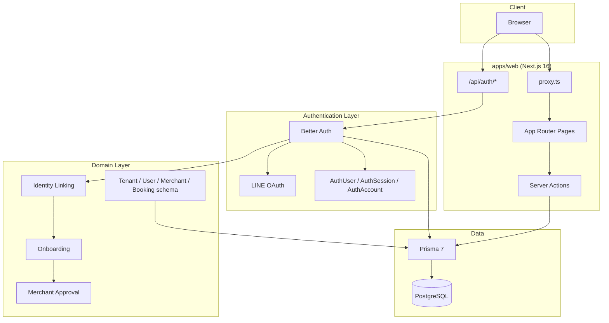
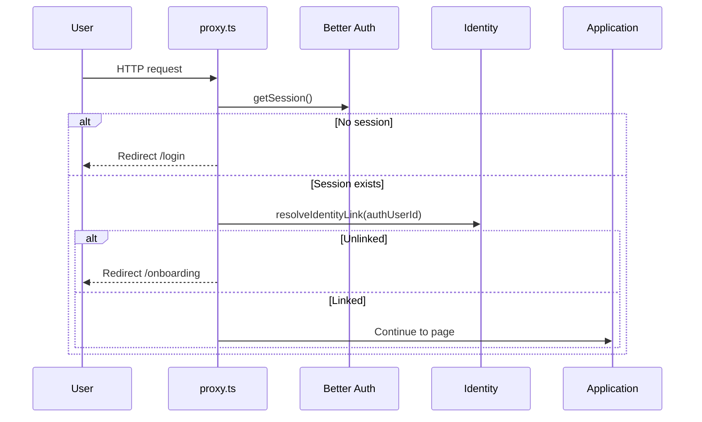

# AutoHub Architecture

AutoHub is a multi-tenant automotive service platform built as a **pnpm + Turborepo** monorepo. The primary application lives in `apps/web` (Next.js 16 App Router, React 19, TypeScript strict). Shared UI components live in `packages/ui`.

This documentation describes the **current implementation** as of the completed phases through Merchant Approval. It does not describe planned features as if they already exist.

## System overview



## Architecture areas

| Area | Status | Documentation |
|------|--------|---------------|
| [Authentication](./authentication.md) | Implemented | Better Auth, LINE-only login, auth models |
| [Identity](./authentication.md#identity-linking) | Implemented | `AuthUser` ↔ domain `User` via `authUserId` |
| [Onboarding](./onboarding.md) | Implemented | Customer and merchant paths |
| [Merchant](./merchant.md) | Implemented | Claims, onboarding requests, approval, dashboards |
| [Booking](./booking.md) | Schema only | Models defined; no application logic |
| [RBAC](./rbac.md) | Schema only | `Role` / `UserRole` defined; not enforced |
| [Tenant](./tenant.md) | Partial | Model and selection during onboarding; no auto-provisioning |
| [Database](./database.md) | Implemented | Prisma 7, PostgreSQL, full ERD |
| [API](./api.md) | Partial | Better Auth routes + server actions; no REST booking API |
| [Roadmap](./roadmap.md) | — | Completed phases and next steps |

## Core design principles

### Authentication is separate from domain identity

Better Auth manages **who signed in** (`AuthUser`). The domain layer manages **who they are in AutoHub** (`User`). These are linked explicitly via `User.authUserId` and never merged automatically at login time.

### Onboarding is separate from authorization

Onboarding creates domain records and links identity. It does **not** assign roles, permissions, or tenant ownership. Route protection checks authentication and identity link status only.

### LINE-only product login

Email/password is disabled. Product authentication is LINE OAuth via Better Auth `genericOAuth` plugin.

### Multi-tenancy is explicit

Every domain `User` belongs to a `Tenant`. Tenants are selected during onboarding from existing active tenants. Tenants are **never** created automatically by the application.

## Repository layout

```
autohub/
├── apps/
│   └── web/                 # Next.js application
│       ├── app/             # App Router pages and API routes
│       ├── auth.ts          # Better Auth configuration
│       ├── proxy.ts         # Route protection (Next.js 16)
│       ├── lib/             # Auth, onboarding, merchant, Prisma
│       └── prisma/          # Schema and migrations
├── packages/
│   └── ui/                  # Shared shadcn UI components
└── docs/
    └── architecture/        # This documentation
```

## Key environment variables

| Variable | Purpose |
|----------|---------|
| `DATABASE_URL` | PostgreSQL connection string |
| `BETTER_AUTH_SECRET` | Better Auth signing secret |
| `BETTER_AUTH_URL` | Server-side auth base URL |
| `NEXT_PUBLIC_BETTER_AUTH_URL` | Client-side auth base URL |
| `LINE_CHANNEL_ID` | LINE Login channel ID |
| `LINE_CHANNEL_SECRET` | LINE Login channel secret |

## Request lifecycle (simplified)



## Related documents

- [authentication.md](./authentication.md) — Better Auth, LINE, auth models, identity linking
- [onboarding.md](./onboarding.md) — Customer and merchant onboarding flows
- [merchant.md](./merchant.md) — Merchant domain, approval, dashboards
- [booking.md](./booking.md) — Booking domain (schema; not yet implemented)
- [rbac.md](./rbac.md) — Planned access control (not implemented)
- [tenant.md](./tenant.md) — Tenant model and resolution
- [database.md](./database.md) — Full Prisma ERD
- [api.md](./api.md) — Routes and server actions
- [roadmap.md](./roadmap.md) — Project phases
