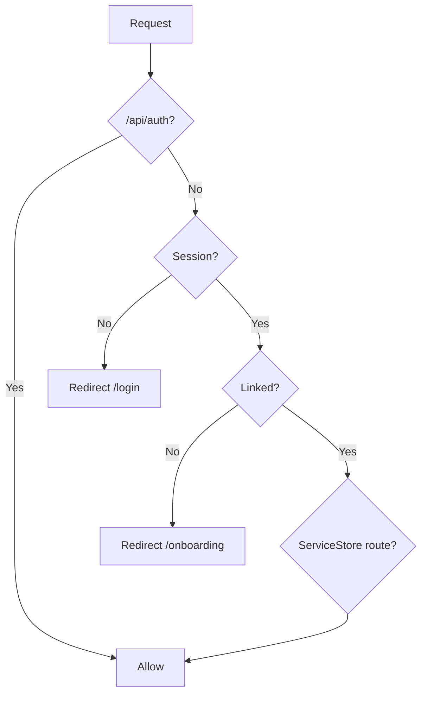

# API

AutoHub's `apps/web` application does **not** expose a traditional REST API for business operations. Interaction patterns are:

1. **Better Auth API routes** — Authentication (`/api/auth/*`)
2. **Next.js App Router pages** — Server-rendered UI
3. **Server Actions** — Mutations from forms (`"use server"`)

There are no `/api/booking`, `/api/serviceStore`, or `/api/customer` REST endpoints.

## Route map (current)

```mermaid
flowchart TD
  subgraph Public
    Home[/]
    Login[/login]
  end

  subgraph AuthAPI["Authentication API"]
    Auth["/api/auth/*"]
  end

  subgraph Onboarding
    OB[/onboarding]
    OBC[/onboarding/customer]
    OBM[/onboarding/serviceStore]
  end

  subgraph App
    Dash[/dashboard]
    Mer[/serviceStore]
    MerD[/service-store/dashboard]
    MerW[/service-store/waiting]
  end

  subgraph Admin
    Admin[/admin/service-store-requests]
  end

  Login --> Auth
  Auth --> OB
  OB --> OBC
  OB --> OBM
  OBC --> Dash
  OBM --> MerW
  Mer --> MerD
  Mer --> MerW
```

## Authentication routes

### Better Auth handler

| Route | Methods | Handler |
|-------|---------|---------|
| `/api/auth/[...all]` | `GET`, `POST` | `toNextJsHandler(auth)` |

**File:** `apps/web/app/api/auth/[...all]/route.ts`

Better Auth handles all authentication sub-routes internally, including:

| Endpoint (internal) | Purpose |
|--------------------|---------|
| `/api/auth/oauth2/callback/line` | LINE OAuth callback |
| Session endpoints | Session creation, validation, revocation |
| Sign-out | Session invalidation |

> Exact sub-route paths are managed by Better Auth. Do not add custom handlers under `/api/auth/` without coordinating with the Better Auth configuration.

### Auth pages

| Route | Type | Purpose |
|-------|------|---------|
| `/login` | Page | LINE sign-in button |

**Client method:**

```typescript
authClient.signIn.oauth2({ providerId: "line", callbackURL, errorCallbackURL })
authClient.signOut()
```

### Session access (not HTTP routes)

| Method | Location |
|--------|----------|
| `auth.api.getSession({ headers })` | Server components, proxy, server actions |
| `authClient.useSession()` | Client components |

## Onboarding routes

All onboarding routes are **App Router pages** backed by **server actions**. No `/api/onboarding` REST endpoints exist.

| Route | Type | Auth required | Identity required |
|-------|------|---------------|-------------------|
| `/onboarding` | Page | Yes | No (unlinked) |
| `/onboarding/customer` | Page | Yes | No (unlinked) |
| `/onboarding/serviceStore` | Page | Yes | No (unlinked) |

### Server actions

| Action | File | Purpose |
|--------|------|---------|
| `completeCustomerOnboarding` | `lib/onboarding/actions.ts` | Create domain `User`, redirect `/dashboard` |
| `completeServiceStoreOnboarding` | `lib/onboarding/actions.ts` | Create `User` + claim/request, redirect `/service-store/waiting` |
| `searchServiceStoresAction` | `lib/onboarding/actions.ts` | Search serviceStores for claim mode |

### Server queries (not exposed as HTTP)

| Function | File | Purpose |
|----------|------|---------|
| `listActiveTenants()` | `lib/onboarding/queries.ts` | Tenant dropdown |
| `searchServiceStores()` | `lib/onboarding/queries.ts` | ServiceStore search |

## ServiceStore routes

| Route | Type | Guard | Purpose |
|-------|------|-------|---------|
| `/service-store` | Page | Linked identity | Redirect hub |
| `/service-store/dashboard` | Page | Approved serviceStore | ServiceStore dashboard |
| `/service-store/waiting` | Page | Pending serviceStore | Waiting for approval |

No `/api/serviceStore` endpoints exist.

### ServiceStore server actions

| Action | File | Purpose |
|--------|------|---------|
| `approveServiceStoreClaim` | `lib/service-store/actions.ts` | Approve claim |
| `rejectServiceStoreClaim` | `lib/service-store/actions.ts` | Reject claim |
| `approveServiceStoreOnboardingRequest` | `lib/service-store/actions.ts` | Approve request, create serviceStore |
| `rejectServiceStoreOnboardingRequest` | `lib/service-store/actions.ts` | Reject request |

### ServiceStore server queries

| Function | File | Purpose |
|----------|------|---------|
| `getServiceStoreAccessState()` | `lib/service-store/access.ts` | Routing state |
| `listPendingServiceStoreClaims()` | `lib/service-store/queries.ts` | Admin list |
| `listPendingServiceStoreOnboardingRequests()` | `lib/service-store/queries.ts` | Admin list |

## Admin routes

| Route | Type | Guard | Purpose |
|-------|------|-------|---------|
| `/admin/service-store-requests` | Page | Linked identity | List and approve/reject serviceStore requests |

> **Note:** No RBAC check. Any linked user can access this page. See [rbac.md](./rbac.md).

Admin actions are invoked via client components calling server actions directly (not HTTP POST to `/api/admin/*`).

## Application routes

| Route | Type | Guard | Purpose |
|-------|------|-------|---------|
| `/` | Page | None | Placeholder home |
| `/dashboard` | Page | Linked identity, non-serviceStore | Customer dashboard |

## Route protection

`apps/web/proxy.ts` intercepts requests before pages load:



Proxy does not protect server actions directly — actions perform their own session checks.

## Server action authentication pattern

All server actions follow this pattern:

```typescript
"use server";

const session = await getServerSession();
if (!session) return { error: "..." };

const identity = await resolveIdentityLink(session.user.id);
if (!isIdentityLinked(identity)) { /* redirect or error */ }
```

## Future APIs (not implemented)

The following are **planned** and do not exist:

| API | Purpose |
|-----|---------|
| `POST /api/bookings` | Create booking |
| `GET /api/bookings` | List bookings |
| `PATCH /api/bookings/:id` | Update booking status |
| `GET /api/serviceStores/:id/branches` | Branch catalog |
| `GET /api/branches/:id/services` | Service catalog |
| `GET /api/availability` | Booking slot availability |
| `POST /api/customers` | Customer management |
| `GET /api/admin/tenants` | Tenant administration |
| Webhook endpoints | Payments, notifications |

Future APIs may be implemented as:

- Next.js Route Handlers (`app/api/...`)
- tRPC or similar
- Server Actions (current pattern)

## External integrations (current)

| Service | Integration point |
|---------|-------------------|
| LINE Login | Better Auth `genericOAuth` → `/api/auth/oauth2/callback/line` |
| PostgreSQL | Prisma adapter |

No payment, notification, or analytics integrations exist.

## Related documents

- [authentication.md](./authentication.md) — Better Auth details
- [onboarding.md](./onboarding.md) — Onboarding server actions
- [serviceStore.md](./serviceStore.md) — ServiceStore approval actions
- [roadmap.md](./roadmap.md) — Future API phases
