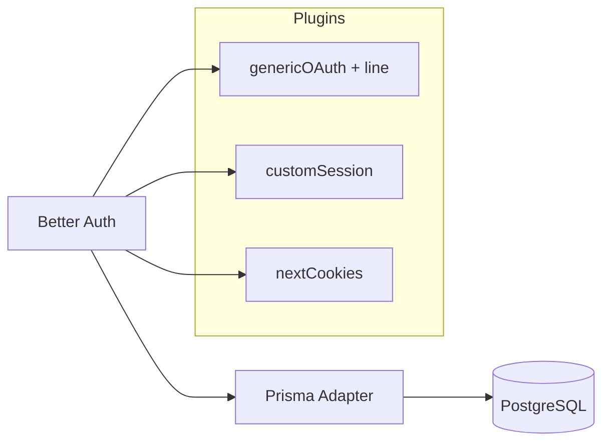
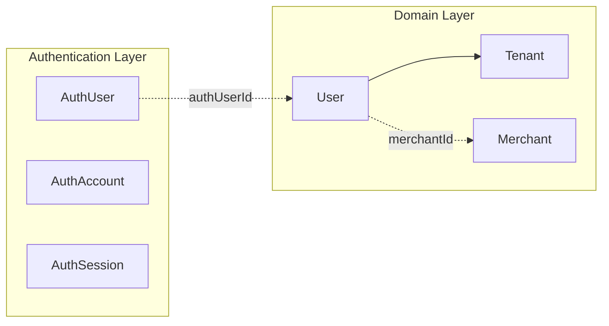

# Authentication

AutoHub uses [Better Auth](https://www.better-auth.com/) v1.6.x as the authentication framework. Product login is **LINE-only**; email/password is disabled.

Configuration lives in `apps/web/auth.ts`. The Prisma adapter persists auth state to PostgreSQL.

## Auth models

Better Auth models are mapped to dedicated Prisma tables, separate from domain models.

| Prisma model | DB table | Purpose |
|--------------|----------|---------|
| `AuthUser` | `authUser` | Authenticated identity (Better Auth user) |
| `AuthSession` | `authSession` | Active session tokens |
| `AuthAccount` | `authAccount` | OAuth provider linkage (LINE) |
| `AuthVerification` | `authVerification` | Verification tokens (Better Auth internal) |

### AuthUser

Stores the authenticated principal created by Better Auth.

| Field | Notes |
|-------|-------|
| `id` | Better Auth user ID (string, not UUID auto-generated) |
| `name` | Display name from provider |
| `email` | Email from provider (required by Better Auth schema) |
| `emailVerified` | Default `false` |
| `image` | Optional profile image URL |

### AuthSession

| Field | Notes |
|-------|-------|
| `token` | Unique session token |
| `expiresAt` | Session expiry |
| `userId` | FK → `AuthUser.id` |
| `ipAddress`, `userAgent` | Optional request metadata |

Session configuration:

- `expiresIn`: 7 days
- `updateAge`: 1 day

### AuthAccount

Links an `AuthUser` to an OAuth provider.

| Field | Notes |
|-------|-------|
| `providerId` | `"line"` for LINE Login |
| `accountId` | LINE user ID |
| `userId` | FK → `AuthUser.id` |
| `accessToken`, `refreshToken`, etc. | OAuth tokens |

The LINE user ID is retrieved from `AuthAccount.accountId` where `providerId = "line"` during onboarding (`lib/onboarding/context.ts`).

### AuthVerification

Used by Better Auth for verification flows. No application logic references this model directly.

## Better Auth configuration



| Setting | Value |
|---------|-------|
| Adapter | `prismaAdapter` (PostgreSQL) |
| Email/password | Disabled |
| OAuth provider | LINE (`providerId: "line"`, PKCE enabled) |
| Model mapping | `authUser`, `authSession`, `authAccount`, `authVerification` |

### Plugins

1. **`genericOAuth` + `line()`** — LINE Login OAuth2 flow
2. **`customSession`** — Enriches session with identity link data (`domainUserId`, `identity`)
3. **`nextCookies`** — Cookie handling for Next.js

## LINE Login

LINE Login is the only product sign-in method.

**Callback URL:** `{BETTER_AUTH_URL}/api/auth/oauth2/callback/line`

**Client flow** (`app/login/page.tsx`):

```typescript
authClient.signIn.oauth2({
  providerId: "line",
  callbackURL: callbackUrl,
  errorCallbackURL: "/login?error=auth",
});
```

**Environment variables:**

- `LINE_CHANNEL_ID`
- `LINE_CHANNEL_SECRET`

On successful LINE authentication, Better Auth creates or updates:

- `AuthUser`
- `AuthAccount` (provider `line`)
- `AuthSession`

No domain `User` is created at this stage.

## Authentication flow

```mermaid
flowchart TD
  A[User visits /login] --> B[Continue with LINE]
  B --> C[LINE OAuth]
  C --> D[Better Auth callback]
  D --> E[AuthUser + AuthAccount + AuthSession created]
  E --> F[Identity resolution]
  F --> G{Domain User linked?}
  G -->|No| H[/onboarding]
  G -->|Yes| I[Application routes]
  E --> J[Session cookie set]
  J --> F
```

End-to-end path:

```
LINE Login
    ↓
Better Auth
    ↓
Identity (resolveIdentityLink)
    ↓
Session (AuthSession + enriched custom session)
    ↓
Application (proxy.ts route guards)
```

## Session access

### Server

```typescript
// lib/auth/session.ts
auth.api.getSession({ headers: await headers() })
```

Helpers:

| Function | Location | Behavior |
|----------|----------|----------|
| `getServerSession()` | `lib/auth/session.ts` | Returns session or `null` |
| `requireServerSession()` | `lib/auth/session.ts` | Throws if no session |
| `getAuthenticatedIdentity()` | `lib/auth/require-identity.ts` | Session + identity link |
| `requireLinkedIdentity()` | `lib/auth/require-identity.ts` | Redirects if unauthenticated or unlinked |

### Client

```typescript
// lib/auth-client.ts
createAuthClient({
  plugins: [genericOAuthClient(), customSessionClient<typeof auth>()],
})
```

Exports: `signIn`, `signOut`, `useSession`, `getSession`.

### Custom session shape

The `customSession` plugin adds:

```typescript
{
  user: { ...authUser, domainUserId: string | null },
  session: { ... },
  identity: { status: "linked" | "unlinked", domainUserId: string | null }
}
```

## Identity linking

Identity linking connects `AuthUser` to the domain `User`.

| Field | Model | Purpose |
|-------|-------|---------|
| `authUserId` | `User` | FK-like link to `AuthUser.id` (nullable, unique) |

Resolution (`lib/auth/identity.ts`):

```typescript
resolveIdentityLink(authUserId)
  → find User where authUserId = authUserId
  → { status: "linked" | "unlinked", domainUserId }
```

| Status | Meaning |
|--------|---------|
| `linked` | Domain `User` exists with matching `authUserId` |
| `unlinked` | No domain `User` for this auth user |

## Why AuthUser is separated from domain User



**Reasons for separation:**

1. **Different lifecycles** — Authentication can succeed before a domain profile exists. LINE login creates `AuthUser` immediately; domain `User` is created only during onboarding.

2. **Different responsibilities** — `AuthUser` answers *who signed in*. Domain `User` answers *who they are in AutoHub* (tenant member, merchant operator, profile data).

3. **Provider independence** — Auth provider details (tokens, provider IDs) stay in `AuthAccount`. Domain logic never depends on OAuth token structure.

4. **Explicit linking** — `User.authUserId` is set deliberately during onboarding, not automatically by Better Auth hooks. This prevents orphan or duplicate domain users.

5. **Schema isolation** — Better Auth manages auth tables via its adapter. Domain models remain under application control.

6. **Future flexibility** — Multiple domain personas (customer profile via `Customer`, staff via `User`) can coexist without conflating them with the auth principal.

## Route protection

`apps/web/proxy.ts` (Next.js 16 proxy, replaces middleware) enforces:

| Condition | Behavior |
|-----------|----------|
| No session | Redirect to `/login` (except `/login`, `/api/auth`) |
| Session, unlinked identity | Redirect to `/onboarding` (except onboarding paths) |
| Session, linked identity | Allow application routes; merchant-specific redirects apply |

`/api/auth/*` is always allowed through.

## Logout

`components/logout-button.tsx` calls `authClient.signOut()` which invalidates the Better Auth session and redirects to `/login`.

## What is NOT implemented

- Email/password authentication
- Additional OAuth providers
- `databaseHooks` in Better Auth
- Automatic domain `User` provisioning at login
- RBAC or permission checks in auth layer
