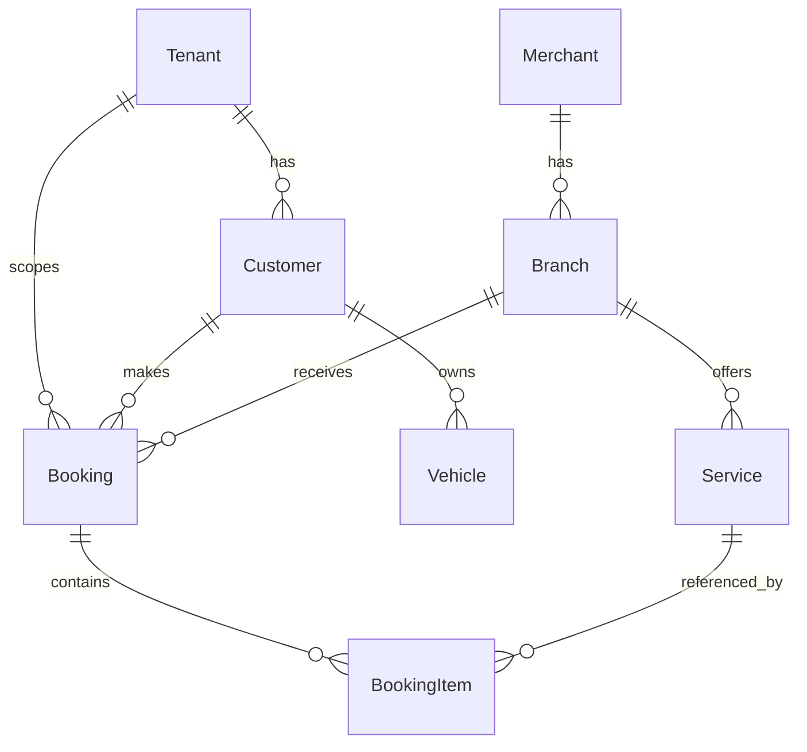
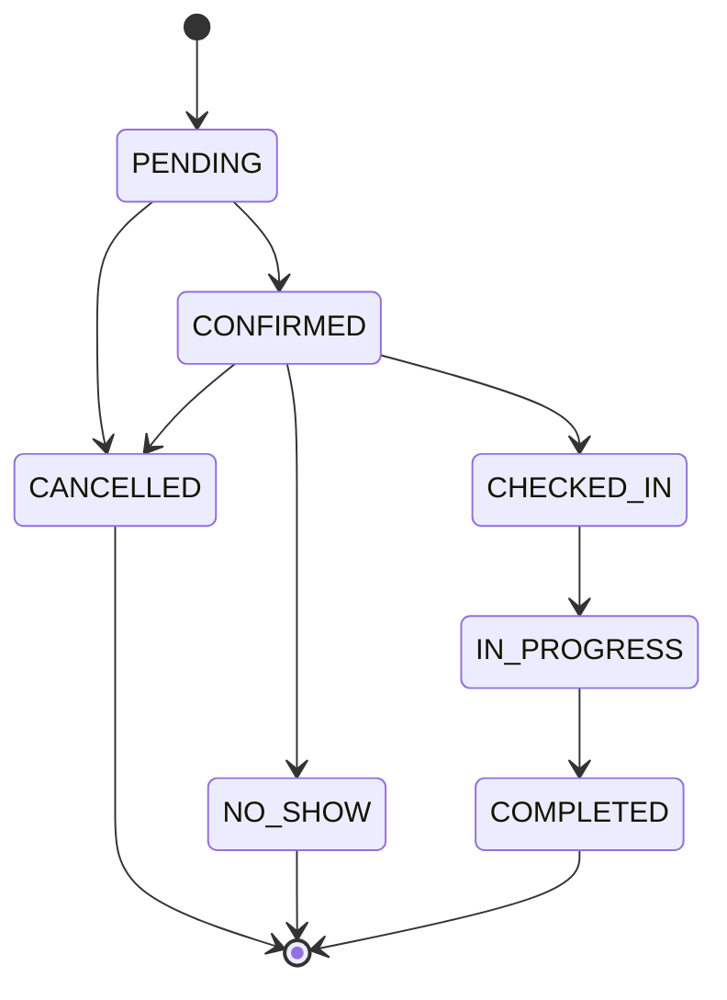
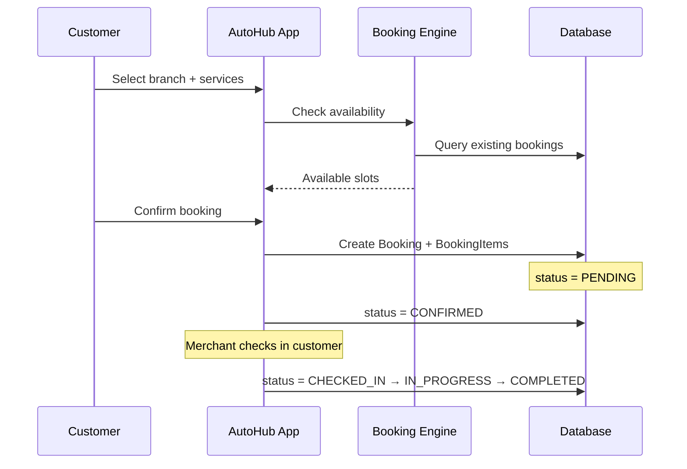

# Booking

The booking domain defines how customers schedule automotive services. **Only the Prisma schema and migrations exist.** No booking application logic, API routes, or UI have been implemented.

## Domain model overview



## Customer

Represents a service customer within a tenant.

| Field | Type | Notes |
|-------|------|-------|
| `id` | UUID | Primary key |
| `tenantId` | UUID | FK → `Tenant` |
| `lineUserId` | String? | Unique; optional LINE link |
| `firstName`, `lastName` | String | Required |
| `phone`, `email` | String? | Optional |
| `status` | `CustomerStatus` | `ACTIVE` (default) or `INACTIVE` |

**Current implementation:** Schema only. Not created during customer onboarding (only domain `User` is created).

## Vehicle

A vehicle belonging to a customer.

| Field | Notes |
|-------|-------|
| `customerId` | FK → `Customer` |
| `brand`, `model` | Required |
| `year` | Optional |
| `licensePlate` | Required; unique per customer |
| `color` | Optional |

**Current implementation:** Schema only.

## Branch

See [merchant.md](./merchant.md). Bookings are associated with a branch (service location).

| Relationship | Notes |
|--------------|-------|
| `Branch` → `Merchant` | Branch belongs to merchant |
| `Branch` → `Booking` | Booking is at a branch |

**Current implementation:** Schema only.

## Service

A bookable service offered at a branch.

| Field | Notes |
|-------|-------|
| `branchId` | FK → `Branch` |
| `code` | Unique per branch |
| `name` | Service name |
| `duration` | Minutes |
| `price` | `Decimal` |
| `isActive` | Default `true` |

**Current implementation:** Schema only.

## Booking

A service appointment.

| Field | Type | Notes |
|-------|------|-------|
| `id` | UUID | Primary key |
| `tenantId` | UUID | FK → `Tenant` |
| `customerId` | UUID | FK → `Customer` |
| `branchId` | UUID | FK → `Branch` |
| `source` | `BookingSource` | Required |
| `status` | `BookingStatus` | Default `PENDING` |
| `bookingDate` | DateTime | Scheduled date/time |
| `note` | String? | Optional |

### BookingSource enum

| Value | Meaning |
|-------|---------|
| `AUTOHUB` | Online booking |
| `WALK_IN` | Walk-in |
| `PHONE` | Phone booking |
| `MANUAL` | Manual entry |

### BookingStatus enum



| Status | Description |
|--------|-------------|
| `PENDING` | Initial state |
| `CONFIRMED` | Confirmed appointment |
| `CHECKED_IN` | Customer arrived |
| `IN_PROGRESS` | Service in progress |
| `COMPLETED` | Service finished |
| `CANCELLED` | Cancelled |
| `NO_SHOW` | Customer did not arrive |

**Current implementation:** Schema only. No status transition logic exists.

## BookingItem

A line item within a booking, referencing a service.

| Field | Notes |
|-------|-------|
| `bookingId` | FK → `Booking` |
| `serviceId` | FK → `Service` |
| `quantity` | Default `1` |
| `unitPrice` | `Decimal` — price at time of booking |

Capturing `unitPrice` on the item allows historical pricing even if the service price changes later.

**Current implementation:** Schema only.

## Booking lifecycle (planned)

The following describes the **intended** lifecycle. None of this is implemented.



## Future booking engine

The booking engine is **not implemented**. Planned capabilities include:

| Capability | Status |
|------------|--------|
| Availability calculation | Not implemented |
| Slot scheduling | Not implemented |
| Booking creation API/UI | Not implemented |
| Status transition workflows | Not implemented |
| Conflict detection | Not implemented |
| Customer vehicle selection | Not implemented |
| Merchant booking management | Not implemented |
| Notifications (confirmation, reminder) | Not implemented |

### Anticipated components (future)

```
lib/booking/
  availability.ts    # Slot calculation
  actions.ts         # Create/update/cancel bookings
  queries.ts         # List bookings by customer/merchant

app/booking/         # Customer booking UI
app/merchant/bookings/  # Merchant booking management
```

### Design considerations (future)

- Bookings are scoped to `tenantId` for multi-tenancy
- `BookingItem.unitPrice` snapshots service price
- `Booking.source` tracks origin channel
- Branch `Service` catalog defines what can be booked
- `Customer` (not domain `User`) is the booking principal

## Relationship to current onboarding

Customer onboarding creates a domain `User`, not a `Customer` record. A future phase will need to either:

- Create `Customer` during customer onboarding, or
- Link domain `User` to `Customer` as a separate step

This decision is not yet implemented.

## What exists today

| Component | Status |
|-----------|--------|
| Prisma models (`Customer`, `Vehicle`, `Booking`, `BookingItem`) | Schema + migrations |
| Enums (`BookingSource`, `BookingStatus`, `CustomerStatus`) | Schema |
| Application logic | None |
| API routes | None |
| UI | None |
