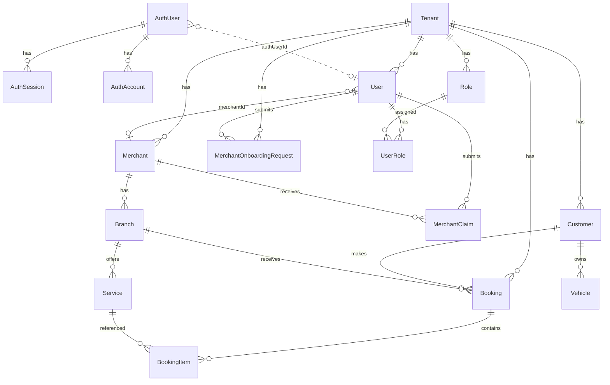

# Database

AutoHub uses **PostgreSQL** with **Prisma 7** as the ORM. The Prisma client is generated to `apps/web/lib/generated/prisma`.

Configuration:

- Schema: `apps/web/prisma/schema.prisma`
- Config: `apps/web/prisma.config.ts`
- Migrations: `apps/web/prisma/migrations/`
- Singleton: `apps/web/lib/prisma.ts` (uses `@prisma/adapter-pg`)

## Model categories

Models are divided into two layers:

| Layer | Models | Managed by |
|-------|--------|------------|
| **Authentication** | `AuthUser`, `AuthSession`, `AuthAccount`, `AuthVerification` | Better Auth (Prisma adapter) |
| **Business** | All other models | Application code |

Authentication models are intentionally separate from business models. See [authentication.md](./authentication.md).

## Full ERD



## Authentication models

### AuthUser

| Column | Type | Constraints |
|--------|------|-------------|
| `id` | String | PK |
| `name` | String | |
| `email` | String | Unique |
| `emailVerified` | Boolean | Default `false` |
| `image` | String? | |
| `createdAt` | DateTime | |
| `updatedAt` | DateTime | |

**Table:** `authUser`

### AuthSession

| Column | Type | Constraints |
|--------|------|-------------|
| `id` | String | PK |
| `token` | String | Unique |
| `expiresAt` | DateTime | |
| `userId` | String | FK → `authUser.id` (CASCADE) |
| `ipAddress` | String? | |
| `userAgent` | String? | |
| `createdAt` | DateTime | |
| `updatedAt` | DateTime | |

**Table:** `authSession`

### AuthAccount

| Column | Type | Constraints |
|--------|------|-------------|
| `id` | String | PK |
| `accountId` | String | Provider account ID (LINE user ID) |
| `providerId` | String | `"line"` |
| `userId` | String | FK → `authUser.id` (CASCADE) |
| `accessToken` | String? | |
| `refreshToken` | String? | |
| `idToken` | String? | |
| `accessTokenExpiresAt` | DateTime? | |
| `refreshTokenExpiresAt` | DateTime? | |
| `scope` | String? | |
| `password` | String? | |
| `createdAt` | DateTime | |
| `updatedAt` | DateTime | |

**Table:** `authAccount`

### AuthVerification

| Column | Type | Constraints |
|--------|------|-------------|
| `id` | String | PK |
| `identifier` | String | Indexed |
| `value` | String | |
| `expiresAt` | DateTime | |
| `createdAt` | DateTime | |
| `updatedAt` | DateTime | |

**Table:** `authVerification`

## Business models

### Tenant

| Column | Type | Constraints |
|--------|------|-------------|
| `id` | String | PK, UUID |
| `code` | String | Unique |
| `name` | String | |
| `status` | TenantStatus | Default `ACTIVE` |

**Relations:** `users`, `roles`, `merchants`, `customers`, `bookings`, `merchantOnboardingRequests`

### User (domain)

| Column | Type | Constraints |
|--------|------|-------------|
| `id` | String | PK, UUID |
| `authUserId` | String? | Unique — links to `AuthUser.id` |
| `lineUserId` | String? | Unique |
| `email` | String? | Unique |
| `firstName` | String | |
| `lastName` | String | |
| `phone` | String? | |
| `status` | UserStatus | Default `ACTIVE` |
| `tenantId` | String | FK → `Tenant.id` |
| `merchantId` | String? | FK → `Merchant.id` (SET NULL) |

**Relations:** `tenant`, `merchant`, `userRoles`, `merchantClaims`, `merchantOnboardingRequests`

**Indexes:** `tenantId`, `merchantId`

### Role

| Column | Type | Constraints |
|--------|------|-------------|
| `id` | String | PK, UUID |
| `code` | String | Unique per tenant |
| `name` | String | |
| `tenantId` | String | FK → `Tenant.id` |

**Unique:** `[tenantId, code]`

**Application usage:** Schema only. Not assigned or checked.

### UserRole

| Column | Type | Constraints |
|--------|------|-------------|
| `userId` | String | FK → `User.id` (CASCADE) |
| `roleId` | String | FK → `Role.id` (CASCADE) |
| `assignedAt` | DateTime | |

**PK:** `[userId, roleId]`

**Application usage:** Schema only.

### Merchant

| Column | Type | Constraints |
|--------|------|-------------|
| `id` | String | PK, UUID |
| `tenantId` | String | FK → `Tenant.id` |
| `code` | String | Unique per tenant |
| `name` | String | |
| `description` | String? | |
| `phone`, `email`, `website` | String? | |
| `status` | MerchantStatus | Default `DRAFT` |

**Relations:** `tenant`, `branches`, `claims`, `users`

**Unique:** `[tenantId, code]`

### MerchantClaim

| Column | Type | Constraints |
|--------|------|-------------|
| `id` | String | PK, UUID |
| `merchantId` | String | FK → `Merchant.id` (CASCADE) |
| `userId` | String | FK → `User.id` |
| `status` | ClaimStatus | Default `PENDING` |
| `submittedAt` | DateTime | |
| `reviewedAt` | DateTime? | |

### MerchantOnboardingRequest

| Column | Type | Constraints |
|--------|------|-------------|
| `id` | String | PK, UUID |
| `userId` | String | FK → `User.id` (CASCADE) |
| `tenantId` | String | FK → `Tenant.id` |
| `businessName` | String | |
| `businessCode` | String | |
| `description` | String? | |
| `phone`, `email`, `website` | String? | |
| `status` | OnboardingRequestStatus | Default `PENDING` |
| `submittedAt` | DateTime | |
| `reviewedAt` | DateTime? | |

**Indexes:** `userId`, `tenantId`, `status`

### Branch

| Column | Type | Constraints |
|--------|------|-------------|
| `id` | String | PK, UUID |
| `merchantId` | String | FK → `Merchant.id` (CASCADE) |
| `code` | String | Unique per merchant |
| `name` | String | |
| `phone`, `address` | String? | |
| `latitude`, `longitude` | Decimal? | |

**Application usage:** Schema only.

### Service

| Column | Type | Constraints |
|--------|------|-------------|
| `id` | String | PK, UUID |
| `branchId` | String | FK → `Branch.id` (CASCADE) |
| `code` | String | Unique per branch |
| `name` | String | |
| `duration` | Int | Minutes |
| `price` | Decimal | |
| `isActive` | Boolean | Default `true` |

**Application usage:** Schema only.

### Customer

| Column | Type | Constraints |
|--------|------|-------------|
| `id` | String | PK, UUID |
| `tenantId` | String | FK → `Tenant.id` |
| `lineUserId` | String? | Unique |
| `firstName`, `lastName` | String | |
| `phone`, `email` | String? | |
| `status` | CustomerStatus | Default `ACTIVE` |

**Application usage:** Schema only. Not created during onboarding.

### Vehicle

| Column | Type | Constraints |
|--------|------|-------------|
| `id` | String | PK, UUID |
| `customerId` | String | FK → `Customer.id` (CASCADE) |
| `brand`, `model` | String | |
| `year` | Int? | |
| `licensePlate` | String | Unique per customer |
| `color` | String? | |

**Application usage:** Schema only.

### Booking

| Column | Type | Constraints |
|--------|------|-------------|
| `id` | String | PK, UUID |
| `tenantId` | String | FK → `Tenant.id` |
| `customerId` | String | FK → `Customer.id` |
| `branchId` | String | FK → `Branch.id` |
| `source` | BookingSource | |
| `status` | BookingStatus | Default `PENDING` |
| `bookingDate` | DateTime | |
| `note` | String? | |

**Application usage:** Schema only.

### BookingItem

| Column | Type | Constraints |
|--------|------|-------------|
| `id` | String | PK, UUID |
| `bookingId` | String | FK → `Booking.id` (CASCADE) |
| `serviceId` | String | FK → `Service.id` |
| `quantity` | Int | Default `1` |
| `unitPrice` | Decimal | |

**Application usage:** Schema only.

## Enums

| Enum | Values |
|------|--------|
| `UserStatus` | `ACTIVE`, `INACTIVE`, `SUSPENDED` |
| `TenantStatus` | `ACTIVE`, `INACTIVE` |
| `MerchantStatus` | `DRAFT`, `PENDING_VERIFICATION`, `ACTIVE`, `SUSPENDED` |
| `ClaimStatus` | `PENDING`, `APPROVED`, `REJECTED` |
| `OnboardingRequestStatus` | `PENDING`, `APPROVED`, `REJECTED` |
| `CustomerStatus` | `ACTIVE`, `INACTIVE` |
| `BookingSource` | `AUTOHUB`, `WALK_IN`, `PHONE`, `MANUAL` |
| `BookingStatus` | `PENDING`, `CONFIRMED`, `CHECKED_IN`, `IN_PROGRESS`, `COMPLETED`, `CANCELLED`, `NO_SHOW` |

## Migrations

| Migration | Description |
|-----------|-------------|
| `20260709024834_init` | Initial business schema |
| `20260709044338_add_better_auth` | Auth tables |
| `20260709050900_add_user_auth_user_id` | `User.authUserId` |
| `20260709061400_add_merchant_onboarding_request` | `MerchantOnboardingRequest` |
| `20260709064200_add_user_merchant_id` | `User.merchantId` |

## Key relationships explained

### AuthUser ↔ User (identity link)

Not a database FK. Linked logically via `User.authUserId = AuthUser.id`.

```
AuthUser.id ←── User.authUserId (unique, nullable)
```

### User ↔ Merchant (operator link)

```
User.merchantId → Merchant.id (nullable, set on approval)
```

### Merchant ↔ Tenant

```
Merchant.tenantId → Tenant.id
User.tenantId     → Tenant.id (aligned on merchant approval)
```

### Booking domain chain

```
Tenant → Customer → Booking ← Branch ← Merchant
Booking → BookingItem → Service
Customer → Vehicle
```

## Models with application logic vs schema only

| Model | Application logic |
|-------|-------------------|
| `AuthUser`, `AuthSession`, `AuthAccount`, `AuthVerification` | Better Auth |
| `Tenant` | Read during onboarding |
| `User` | Created during onboarding; updated on merchant approval |
| `Merchant` | Search during onboarding; created on request approval |
| `MerchantClaim` | Created during onboarding; approved/rejected via admin |
| `MerchantOnboardingRequest` | Created during onboarding; approved/rejected via admin |
| `Role`, `UserRole` | None |
| `Branch`, `Service` | None |
| `Customer`, `Vehicle` | None |
| `Booking`, `BookingItem` | None |

## Commands

```bash
cd apps/web
pnpm prisma generate
pnpm prisma migrate deploy    # production
pnpm prisma migrate dev       # development
```
