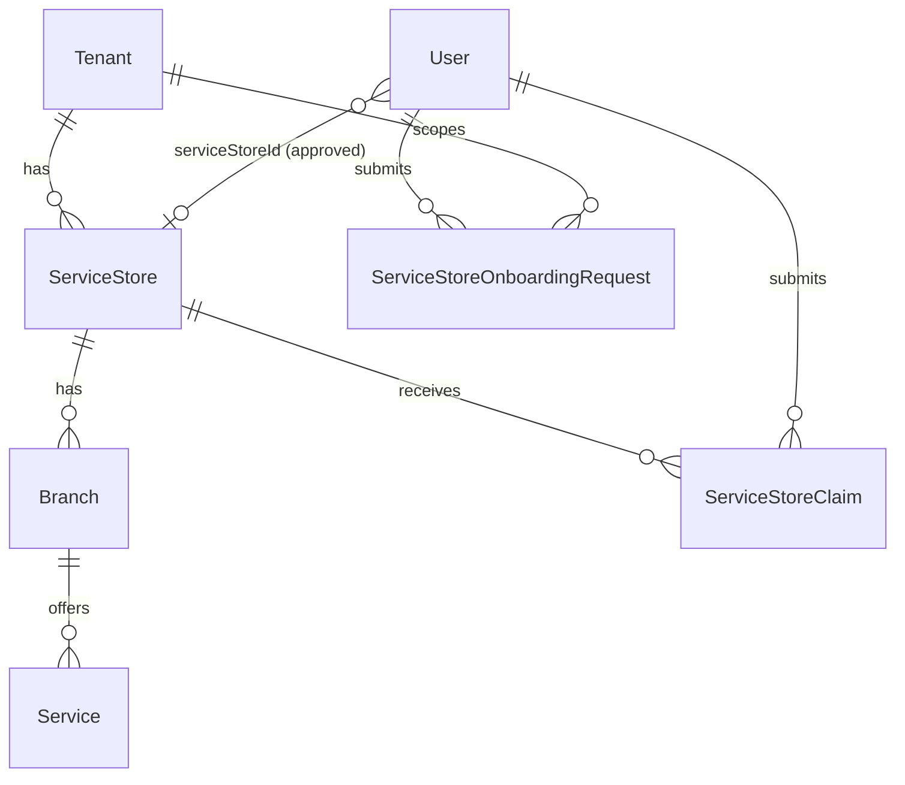
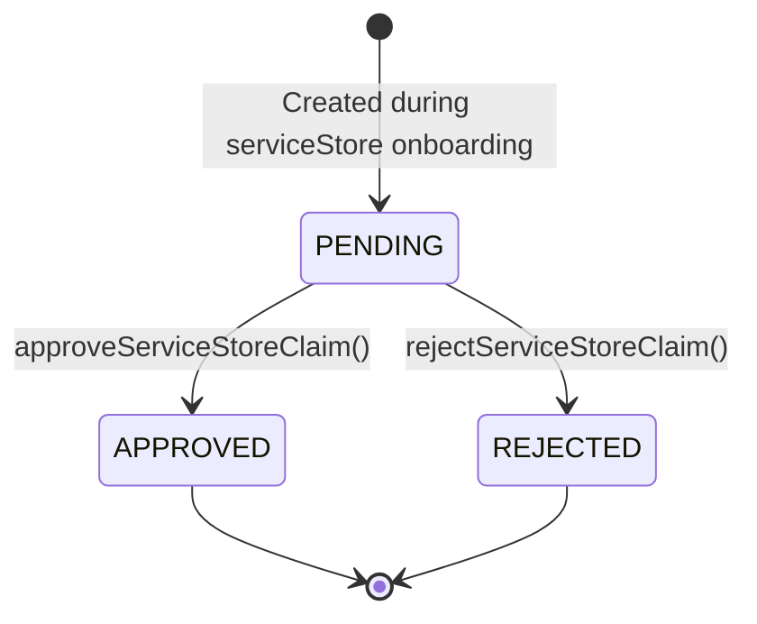

# ServiceStore

This document covers the serviceStore domain as **currently implemented** in AutoHub. Booking-related serviceStore features (branch management UI, service catalog management) are schema-only.

## Domain model overview



## ServiceStore

A `ServiceStore` represents a business operating within a tenant.

| Field | Type | Notes |
|-------|------|-------|
| `id` | UUID | Primary key |
| `tenantId` | UUID | FK → `Tenant` |
| `code` | String | Unique per tenant |
| `name` | String | Display name |
| `description` | String? | Optional |
| `phone`, `email`, `website` | String? | Contact info |
| `status` | `ServiceStoreStatus` | Default `DRAFT` |

**Status enum:** `DRAFT`, `PENDING_VERIFICATION`, `ACTIVE`, `SUSPENDED`

### Current behavior

| Action | When |
|--------|------|
| ServiceStore exists in DB | Seeded or created on onboarding request **approval** |
| Status set to `ACTIVE` | On serviceStore claim **approval** |
| ServiceStore created from request | On onboarding request **approval** with status `ACTIVE` |
| ServiceStore search | During serviceStore onboarding (claim mode) |
| ServiceStore management UI | **Not implemented** |

## Branch

A `Branch` is a physical or logical location belonging to a serviceStore.

| Field | Notes |
|-------|-------|
| `serviceStoreId` | FK → `ServiceStore` |
| `code` | Unique per serviceStore |
| `name` | Branch name |
| `phone`, `address` | Optional |
| `latitude`, `longitude` | Optional (`Decimal`) |

**Current implementation:** Schema and migrations only. No application logic or UI.

## Service

A `Service` is a bookable offering at a branch.

| Field | Notes |
|-------|-------|
| `branchId` | FK → `Branch` |
| `code` | Unique per branch |
| `name` | Service name |
| `duration` | Duration in minutes (`Int`) |
| `price` | `Decimal` |
| `isActive` | Default `true` |

**Current implementation:** Schema and migrations only. No application logic or UI.

## ServiceStore claim

A `ServiceStoreClaim` links a domain `User` to an existing `ServiceStore` pending approval.

| Field | Notes |
|-------|-------|
| `serviceStoreId` | Target serviceStore |
| `userId` | Claiming user |
| `status` | `PENDING` (default), `APPROVED`, `REJECTED` |
| `submittedAt` | Auto-set on creation |
| `reviewedAt` | Set on approval/rejection |

### Lifecycle



### On approval (`lib/service-store/actions.ts`)

1. `ServiceStoreClaim.status` → `APPROVED`, `reviewedAt` set
2. `User.serviceStoreId` → claim's serviceStore ID
3. `User.tenantId` → serviceStore's tenant ID
4. `ServiceStore.status` → `ACTIVE`

No roles or permissions are assigned.

## ServiceStore onboarding request

A `ServiceStoreOnboardingRequest` requests creation of a new serviceStore.

| Field | Notes |
|-------|-------|
| `userId` | Requesting user |
| `tenantId` | Target tenant |
| `businessName`, `businessCode` | Proposed serviceStore identity |
| `description`, `phone`, `email`, `website` | Optional |
| `status` | `PENDING` (default), `APPROVED`, `REJECTED` |

### On approval (`lib/service-store/actions.ts`)

1. Validate business code is not already taken in tenant
2. Create `ServiceStore` from request fields (status `ACTIVE`)
3. `ServiceStoreOnboardingRequest.status` → `APPROVED`, `reviewedAt` set
4. `User.serviceStoreId` → new serviceStore ID
5. `User.tenantId` → request tenant ID

### On rejection

- `ServiceStoreOnboardingRequest.status` → `REJECTED`, `reviewedAt` set
- No `ServiceStore` created
- `User.serviceStoreId` remains `null`

## ServiceStore approval (admin)

**Route:** `/admin/service-store-requests`

**Components:** `components/admin/serviceStore-request-management.tsx`

Lists all pending:

- `ServiceStoreClaim` (pending)
- `ServiceStoreOnboardingRequest` (pending)

Each item has **Approve** and **Reject** actions via server actions in `lib/service-store/actions.ts`:

| Action | Function |
|--------|----------|
| Approve claim | `approveServiceStoreClaim(claimId)` |
| Reject claim | `rejectServiceStoreClaim(claimId)` |
| Approve request | `approveServiceStoreOnboardingRequest(requestId)` |
| Reject request | `rejectServiceStoreOnboardingRequest(requestId)` |

**Access control:** Requires a linked domain identity (`requireLinkedIdentity`). No RBAC enforcement — any linked user can access this page in the current implementation.

## ServiceStore access state

`lib/service-store/access.ts` determines serviceStore user routing:

| State | Condition | Route |
|-------|-----------|-------|
| `approved` | `User.serviceStoreId` is set | `/service-store/dashboard` |
| `pending` | `PENDING` claim or request exists, no `serviceStoreId` | `/service-store/waiting` |
| `none` | No serviceStore activity | `/dashboard` (customer) |

```mermaid
flowchart TD
  U[Linked domain User] --> C{serviceStoreId set?}
  C -->|Yes| D[/service-store/dashboard]
  C -->|No| P{Pending claim or request?}
  P -->|Yes| W[/service-store/waiting]
  P -->|No| CD[/dashboard]
```

## ServiceStore dashboard

**Route:** `/service-store/dashboard`

**Guard:** `requireLinkedIdentity()` + `isApprovedServiceStore()`

Displays:

- User profile name
- Linked serviceStore name, code, status
- Tenant name and code
- Logout button

No operational features (booking management, branch editing, analytics) are implemented.

## ServiceStore waiting

**Route:** `/service-store/waiting`

**Guard:** `requireLinkedIdentity()` + `isPendingServiceStore()`

Displays:

- Waiting for approval message
- Pending claim serviceStore name (if claim pending)
- Pending onboarding request business name (if request pending)
- Logout button

Redirects to `/service-store/dashboard` if approved. Redirects to `/dashboard` if user has no serviceStore activity.

## ServiceStore route hub

**Route:** `/service-store`

Redirects based on serviceStore access state:

- `approved` → `/service-store/dashboard`
- `pending` → `/service-store/waiting`
- `none` → `/dashboard`

## Proxy routing

`proxy.ts` enforces serviceStore route guards:

| Scenario | Redirect |
|----------|----------|
| ServiceStore user visits `/dashboard` | `/service-store/dashboard` or `/service-store/waiting` |
| Customer visits `/service-store/*` | `/dashboard` |
| Approved serviceStore visits `/service-store/waiting` | `/service-store/dashboard` |
| Pending serviceStore visits `/service-store/dashboard` | `/service-store/waiting` |

## User ↔ ServiceStore link

After approval, the domain `User` is linked to the serviceStore:

```
User.serviceStoreId → ServiceStore.id
User.tenantId   → ServiceStore.tenantId (or request tenantId)
```

This is the **current** mechanism for associating an operator with a serviceStore. It is not RBAC — no `UserRole` records are created.

## File reference

| File | Purpose |
|------|---------|
| `lib/service-store/access.ts` | ServiceStore access state |
| `lib/service-store/queries.ts` | List pending claims and requests |
| `lib/service-store/actions.ts` | Approve/reject server actions |
| `app/service-store/dashboard/page.tsx` | Approved serviceStore dashboard |
| `app/service-store/waiting/page.tsx` | Waiting for approval page |
| `app/service-store/page.tsx` | Route hub |
| `app/admin/service-store-requests/page.tsx` | Admin approval UI |
| `components/admin/*` | Admin UI components |

## What is NOT implemented

- ServiceStore management CRUD UI
- Branch management
- Service catalog management
- RBAC-gated admin access
- Notifications on approval/rejection
- Re-submission after rejection
- ServiceStore operator role assignment
