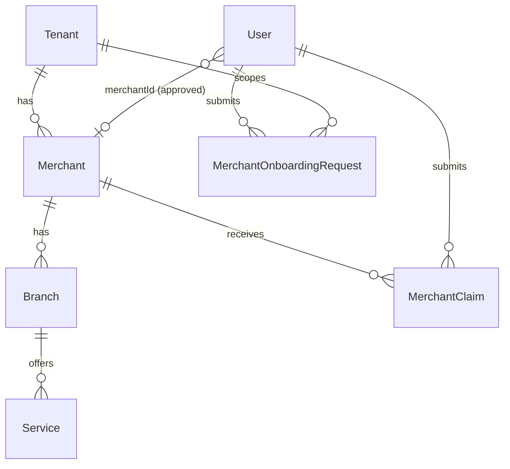
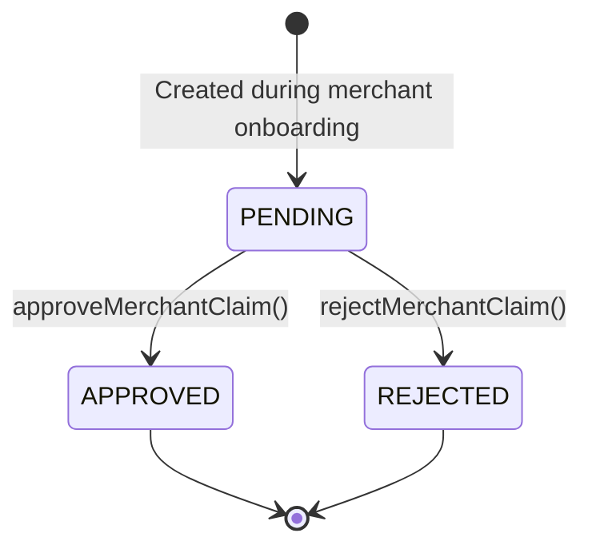

# Merchant

This document covers the merchant domain as **currently implemented** in AutoHub. Booking-related merchant features (branch management UI, service catalog management) are schema-only.

## Domain model overview



## Merchant

A `Merchant` represents a business operating within a tenant.

| Field | Type | Notes |
|-------|------|-------|
| `id` | UUID | Primary key |
| `tenantId` | UUID | FK → `Tenant` |
| `code` | String | Unique per tenant |
| `name` | String | Display name |
| `description` | String? | Optional |
| `phone`, `email`, `website` | String? | Contact info |
| `status` | `MerchantStatus` | Default `DRAFT` |

**Status enum:** `DRAFT`, `PENDING_VERIFICATION`, `ACTIVE`, `SUSPENDED`

### Current behavior

| Action | When |
|--------|------|
| Merchant exists in DB | Seeded or created on onboarding request **approval** |
| Status set to `ACTIVE` | On merchant claim **approval** |
| Merchant created from request | On onboarding request **approval** with status `ACTIVE` |
| Merchant search | During merchant onboarding (claim mode) |
| Merchant management UI | **Not implemented** |

## Branch

A `Branch` is a physical or logical location belonging to a merchant.

| Field | Notes |
|-------|-------|
| `merchantId` | FK → `Merchant` |
| `code` | Unique per merchant |
| `name` | Branch name |
| `phone`, `address` | Optional |
| `latitude`, `longitude` | Optional (`Decimal`) |

**Current implementation:** Schema and migrations only. No application logic or UI.

## Service

A `Service` is a bookable offering at a branch.

| Field | Notes |
|-------|-------|
| `branchId` | FK → `Branch` |
| `code` | Unique per branch |
| `name` | Service name |
| `duration` | Duration in minutes (`Int`) |
| `price` | `Decimal` |
| `isActive` | Default `true` |

**Current implementation:** Schema and migrations only. No application logic or UI.

## Merchant claim

A `MerchantClaim` links a domain `User` to an existing `Merchant` pending approval.

| Field | Notes |
|-------|-------|
| `merchantId` | Target merchant |
| `userId` | Claiming user |
| `status` | `PENDING` (default), `APPROVED`, `REJECTED` |
| `submittedAt` | Auto-set on creation |
| `reviewedAt` | Set on approval/rejection |

### Lifecycle



### On approval (`lib/merchant/actions.ts`)

1. `MerchantClaim.status` → `APPROVED`, `reviewedAt` set
2. `User.merchantId` → claim's merchant ID
3. `User.tenantId` → merchant's tenant ID
4. `Merchant.status` → `ACTIVE`

No roles or permissions are assigned.

## Merchant onboarding request

A `MerchantOnboardingRequest` requests creation of a new merchant.

| Field | Notes |
|-------|-------|
| `userId` | Requesting user |
| `tenantId` | Target tenant |
| `businessName`, `businessCode` | Proposed merchant identity |
| `description`, `phone`, `email`, `website` | Optional |
| `status` | `PENDING` (default), `APPROVED`, `REJECTED` |

### On approval (`lib/merchant/actions.ts`)

1. Validate business code is not already taken in tenant
2. Create `Merchant` from request fields (status `ACTIVE`)
3. `MerchantOnboardingRequest.status` → `APPROVED`, `reviewedAt` set
4. `User.merchantId` → new merchant ID
5. `User.tenantId` → request tenant ID

### On rejection

- `MerchantOnboardingRequest.status` → `REJECTED`, `reviewedAt` set
- No `Merchant` created
- `User.merchantId` remains `null`

## Merchant approval (admin)

**Route:** `/admin/merchant-requests`

**Components:** `components/admin/merchant-request-management.tsx`

Lists all pending:

- `MerchantClaim` (pending)
- `MerchantOnboardingRequest` (pending)

Each item has **Approve** and **Reject** actions via server actions in `lib/merchant/actions.ts`:

| Action | Function |
|--------|----------|
| Approve claim | `approveMerchantClaim(claimId)` |
| Reject claim | `rejectMerchantClaim(claimId)` |
| Approve request | `approveMerchantOnboardingRequest(requestId)` |
| Reject request | `rejectMerchantOnboardingRequest(requestId)` |

**Access control:** Requires a linked domain identity (`requireLinkedIdentity`). No RBAC enforcement — any linked user can access this page in the current implementation.

## Merchant access state

`lib/merchant/access.ts` determines merchant user routing:

| State | Condition | Route |
|-------|-----------|-------|
| `approved` | `User.merchantId` is set | `/merchant/dashboard` |
| `pending` | `PENDING` claim or request exists, no `merchantId` | `/merchant/waiting` |
| `none` | No merchant activity | `/dashboard` (customer) |

```mermaid
flowchart TD
  U[Linked domain User] --> C{merchantId set?}
  C -->|Yes| D[/merchant/dashboard]
  C -->|No| P{Pending claim or request?}
  P -->|Yes| W[/merchant/waiting]
  P -->|No| CD[/dashboard]
```

## Merchant dashboard

**Route:** `/merchant/dashboard`

**Guard:** `requireLinkedIdentity()` + `isApprovedMerchant()`

Displays:

- User profile name
- Linked merchant name, code, status
- Tenant name and code
- Logout button

No operational features (booking management, branch editing, analytics) are implemented.

## Merchant waiting

**Route:** `/merchant/waiting`

**Guard:** `requireLinkedIdentity()` + `isPendingMerchant()`

Displays:

- Waiting for approval message
- Pending claim merchant name (if claim pending)
- Pending onboarding request business name (if request pending)
- Logout button

Redirects to `/merchant/dashboard` if approved. Redirects to `/dashboard` if user has no merchant activity.

## Merchant route hub

**Route:** `/merchant`

Redirects based on merchant access state:

- `approved` → `/merchant/dashboard`
- `pending` → `/merchant/waiting`
- `none` → `/dashboard`

## Proxy routing

`proxy.ts` enforces merchant route guards:

| Scenario | Redirect |
|----------|----------|
| Merchant user visits `/dashboard` | `/merchant/dashboard` or `/merchant/waiting` |
| Customer visits `/merchant/*` | `/dashboard` |
| Approved merchant visits `/merchant/waiting` | `/merchant/dashboard` |
| Pending merchant visits `/merchant/dashboard` | `/merchant/waiting` |

## User ↔ Merchant link

After approval, the domain `User` is linked to the merchant:

```
User.merchantId → Merchant.id
User.tenantId   → Merchant.tenantId (or request tenantId)
```

This is the **current** mechanism for associating an operator with a merchant. It is not RBAC — no `UserRole` records are created.

## File reference

| File | Purpose |
|------|---------|
| `lib/merchant/access.ts` | Merchant access state |
| `lib/merchant/queries.ts` | List pending claims and requests |
| `lib/merchant/actions.ts` | Approve/reject server actions |
| `app/merchant/dashboard/page.tsx` | Approved merchant dashboard |
| `app/merchant/waiting/page.tsx` | Waiting for approval page |
| `app/merchant/page.tsx` | Route hub |
| `app/admin/merchant-requests/page.tsx` | Admin approval UI |
| `components/admin/*` | Admin UI components |

## What is NOT implemented

- Merchant management CRUD UI
- Branch management
- Service catalog management
- RBAC-gated admin access
- Notifications on approval/rejection
- Re-submission after rejection
- Merchant operator role assignment
