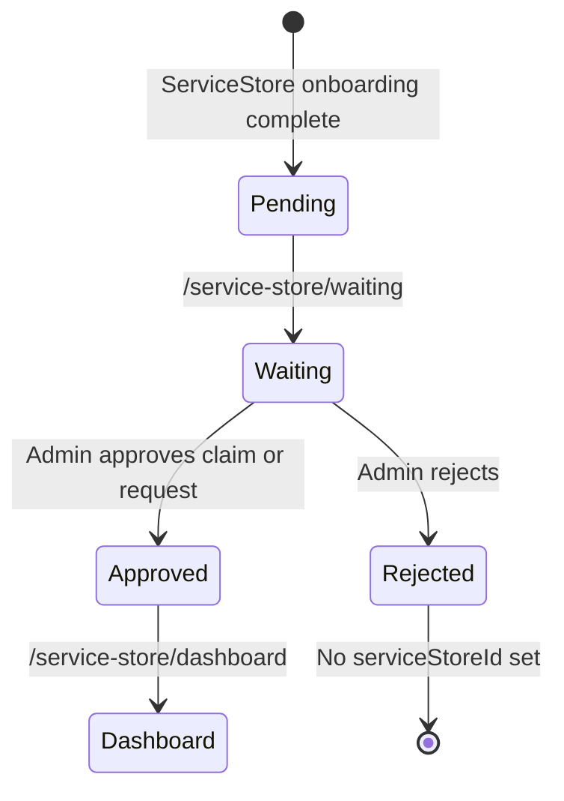
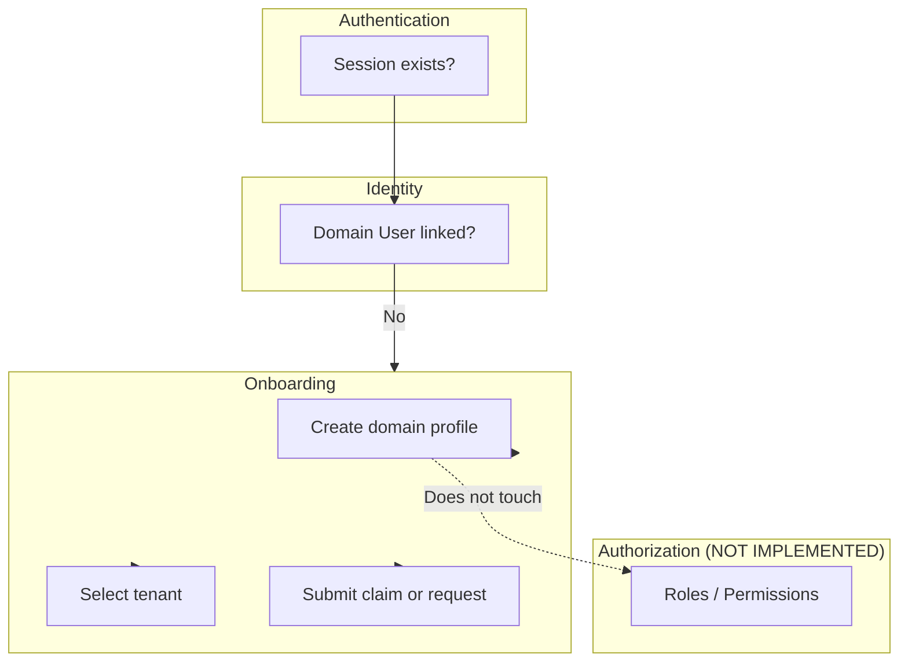

# Onboarding

Onboarding bridges authentication and the domain layer. After LINE login, an authenticated user may have an `AuthUser` but no domain `User`. Onboarding creates the domain profile and links `User.authUserId` to `AuthUser.id`.

Onboarding is implemented in `apps/web/lib/onboarding/` and `apps/web/app/onboarding/`.

## Entry condition

A user enters onboarding when:

- A valid Better Auth session exists, and
- `resolveIdentityLink(authUserId)` returns `status: "unlinked"`

The proxy redirects unlinked authenticated users to `/onboarding`.

## Onboarding choice

`/onboarding` presents two paths:

| Path | Route | Constant |
|------|-------|----------|
| Customer | `/onboarding/customer` | `ONBOARDING_TARGET.CUSTOMER` |
| ServiceStore | `/onboarding/serviceStore` | `ONBOARDING_TARGET.MERCHANT` |

```mermaid
flowchart TD
  Start[/onboarding] --> Choice{Choose path}
  Choice -->|Customer| CP[/onboarding/customer]
  Choice -->|ServiceStore| MP[/onboarding/serviceStore]
  CP --> CF[Profile form]
  MP --> MF[Profile + business form]
  CF --> CU[Create domain User]
  MF --> MU[Create domain User + claim or request]
  CU --> CD[/dashboard]
  MU --> MW[/service-store/waiting]
```

## Customer onboarding

**Route:** `/onboarding/customer`

**Server action:** `completeCustomerOnboarding` (`lib/onboarding/actions.ts`)

### Steps

1. User selects an **existing active tenant** from a dropdown
2. User completes profile: `firstName`, `lastName`, optional `phone`, optional `email`
3. Server validates input (Zod schema in `lib/onboarding/schemas.ts`)
4. Server creates domain `User` with:
   - `authUserId` → current `AuthUser.id`
   - `lineUserId` → from `AuthAccount` (LINE provider), if available
   - `tenantId` → selected tenant
   - Profile fields
5. Redirect to `/dashboard`

### What is created

| Record | Created |
|--------|---------|
| Domain `User` | Yes |
| `Customer` | No |
| `ServiceStore` | No |
| `Tenant` | No |
| Roles | No |

> **Note:** The `Customer` model exists in the schema but is **not** created during customer onboarding. Only the domain `User` is created.

## ServiceStore onboarding

**Route:** `/onboarding/serviceStore`

**Server action:** `completeServiceStoreOnboarding` (`lib/onboarding/actions.ts`)

### Steps

1. User selects an **existing active tenant**
2. User completes personal profile (`firstName`, `lastName`, `phone`, `email`)
3. User chooses a business setup mode:

#### Mode A: Claim existing business

- Search serviceStores within the selected tenant by name or code
- Select a serviceStore from search results
- Server creates:
  - Domain `User` (with `authUserId` linked)
  - `ServiceStoreClaim` with `status: PENDING`

#### Mode B: Request new business

- Enter business details: `businessName`, `businessCode`, optional `description`, `phone`, `email`, `website`
- Server creates:
  - Domain `User` (with `authUserId` linked)
  - `ServiceStoreOnboardingRequest` with `status: PENDING`

4. Redirect to `/service-store/waiting`

### What is NOT created during serviceStore onboarding

| Record | Created |
|--------|---------|
| `ServiceStore` (new) | No — only on approval of onboarding request |
| `Tenant` | No |
| `User.serviceStoreId` | No — set on approval |
| Roles | No |

## ServiceStore claim

A **serviceStore claim** (`ServiceStoreClaim`) represents a domain user's request to operate an existing serviceStore.

| Field | Purpose |
|-------|---------|
| `serviceStoreId` | Target serviceStore |
| `userId` | Claiming domain user |
| `status` | `PENDING` → `APPROVED` or `REJECTED` |
| `submittedAt` | Claim submission time |
| `reviewedAt` | Set on approval/rejection |

Claims are created during serviceStore onboarding (claim mode) and reviewed via the admin serviceStore request management UI.

## ServiceStore onboarding request

A **serviceStore onboarding request** (`ServiceStoreOnboardingRequest`) represents a request to register a new business.

| Field | Purpose |
|-------|---------|
| `userId` | Requesting domain user |
| `tenantId` | Target tenant |
| `businessName`, `businessCode` | Proposed serviceStore identity |
| `description`, `phone`, `email`, `website` | Optional business details |
| `status` | `PENDING` → `APPROVED` or `REJECTED` |

On approval, a new `ServiceStore` record is created from the request data. See [serviceStore.md](./serviceStore.md).

## Waiting approval flow

After serviceStore onboarding, the user is redirected to `/service-store/waiting`.



**Pending detection** (`lib/service-store/access.ts`):

A serviceStore user is `pending` when:

- `User.serviceStoreId` is `null`, AND
- A `PENDING` `ServiceStoreClaim` or `PENDING` `ServiceStoreOnboardingRequest` exists

**Approved detection:**

- `User.serviceStoreId` is set

The waiting page displays the pending claim or onboarding request details. No automatic polling or notification is implemented.

## Validation

Input validation uses Zod schemas in `lib/onboarding/schemas.ts`:

| Schema | Used for |
|--------|----------|
| `customerOnboardingSchema` | Customer profile |
| `serviceStoreOnboardingSchema` | ServiceStore profile + claim or request (discriminated union on `mode`) |

## Tenant selection

Both onboarding paths require selecting an existing `ACTIVE` tenant. The list comes from `listActiveTenants()` (`lib/onboarding/queries.ts`).

If no tenants exist, the form displays a message to contact an administrator.

Tenants are **never** created by onboarding.

## Why onboarding is separate from authorization



**Separation rationale:**

1. **Onboarding answers "who are you in AutoHub?"** — It creates domain records and links identity. It does not decide what the user can do.

2. **Authorization answers "what can you do?"** — RBAC (`Role`, `UserRole`) is defined in the schema but not assigned or enforced. No permissions are granted during onboarding.

3. **Route guards use identity, not roles** — `proxy.ts` checks session and identity link status. ServiceStore route guards check serviceStore access state (`approved` / `pending` / `none`), not roles.

4. **Approval is a business workflow, not auth** — ServiceStore claim/request approval links `User` to `ServiceStore` and `Tenant`. It does not assign `UserRole` records.

5. **Admin request management has no RBAC gate** — `/admin/service-store-requests` requires a linked identity only. Formal admin access control is planned for the future.

## File reference

| File | Purpose |
|------|---------|
| `lib/onboarding/context.ts` | `requireOnboardingContext()`, LINE user ID lookup |
| `lib/onboarding/schemas.ts` | Zod validation |
| `lib/onboarding/queries.ts` | Tenant list, serviceStore search |
| `lib/onboarding/actions.ts` | Server actions |
| `components/onboarding/*` | Form UI components |
| `app/onboarding/*` | Onboarding pages |

## What is NOT implemented

- Automatic tenant creation
- RBAC assignment during onboarding
- `Customer` record creation during customer onboarding
- Email verification
- Onboarding progress persistence (multi-session resume)
- Re-submission flow after rejected serviceStore requests
