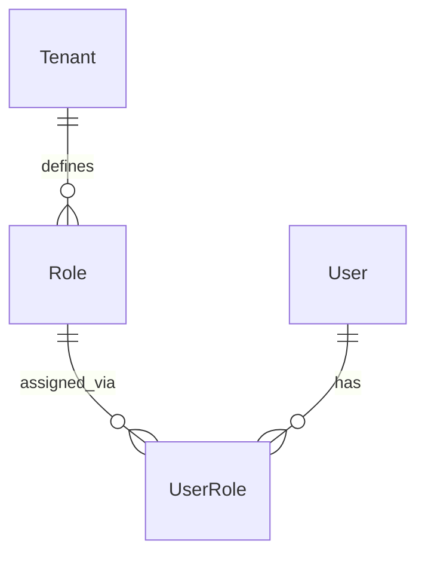
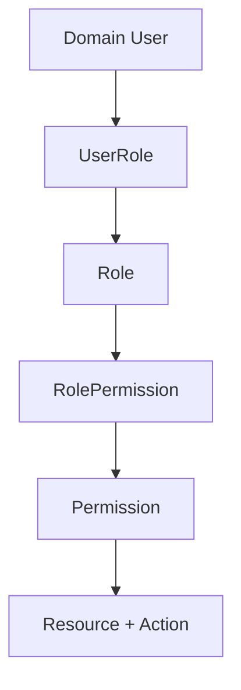
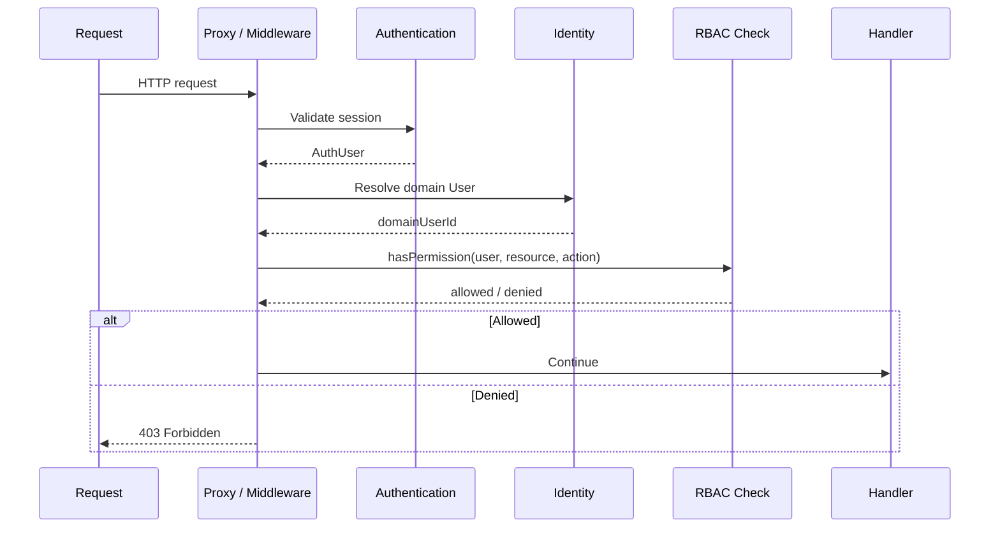

# RBAC (Role-Based Access Control)

RBAC is **planned but not implemented** in AutoHub. The database schema defines role structures, but no application code assigns roles, checks permissions, or enforces access based on roles.

> **Important:** Do not assume RBAC is active. Current route protection uses authentication, identity linking, and merchant access state only.

## Current state

| Component | Schema | Application logic | Enforced |
|-----------|--------|-------------------|----------|
| `Role` | Yes | No | No |
| `UserRole` | Yes | No | No |
| `Permission` | No | No | No |
| Route guards based on roles | — | No | No |
| Admin access control | — | No | No |

## Planned schema (existing)

### Role

A named role within a tenant.

| Field | Notes |
|-------|-------|
| `id` | UUID |
| `code` | Unique per tenant (e.g. `admin`, `merchant_operator`) |
| `name` | Display name |
| `tenantId` | FK → `Tenant` |

### UserRole

Join table linking domain `User` to `Role`.

| Field | Notes |
|-------|-------|
| `userId` | FK → `User` |
| `roleId` | FK → `Role` |
| `assignedAt` | Assignment timestamp |

Composite primary key: `[userId, roleId]`

**Current implementation:** Table exists. No records are created by onboarding, merchant approval, or any other application flow.

## Planned: Permission model

A `Permission` model does **not** exist in the current schema. The planned architecture:

### Anticipated Permission shape (future)

| Concept | Example |
|---------|---------|
| Resource | `merchant`, `booking`, `branch`, `service` |
| Action | `read`, `create`, `update`, `delete`, `approve` |
| Scope | Tenant-level or merchant-level |

Example permission codes:

- `merchant:read`
- `booking:create`
- `merchant_request:approve`

## Planned access control flow (future)

## What uses access control today (not RBAC)

Current route protection in `proxy.ts`:

| Check | Mechanism |
|-------|-----------|
| Authenticated | Better Auth session |
| Identity linked | `resolveIdentityLink()` |
| Merchant approved | `getMerchantAccessState()` |
| Admin merchant requests | `requireLinkedIdentity()` only |

The admin merchant request page (`/admin/merchant-requests`) is accessible to **any linked user**. This is a known gap until RBAC is implemented.

## Planned integration points (future)

| Area | Planned RBAC usage |
|------|-------------------|
| Admin merchant approval | Restrict to `merchant_request:approve` |
| Merchant dashboard | Require `merchant:read` or merchant operator role |
| Booking management | `booking:*` permissions |
| Tenant administration | Tenant admin role |
| Branch/service management | Merchant-scoped permissions |

## Design principles (planned)

1. **Roles are tenant-scoped** — `Role.tenantId` ensures roles do not leak across tenants
2. **Permissions are granular** — Resource + action, not role names in application code
3. **Separation from authentication** — RBAC runs after identity resolution
4. **Separation from onboarding** — Roles assigned explicitly, not during onboarding
5. **No automatic role assignment** — Merchant approval links `User` to `Merchant` but does not assign roles (current and planned initial behavior)

## What is NOT implemented

- `Permission` model
- `RolePermission` join table
- `hasPermission()` or equivalent helper
- Role assignment during onboarding or merchant approval
- Role-based route guards
- Role-based server action guards
- Admin UI for role management
- Permission seeding

## Related documents

- [authentication.md](./authentication.md) — Current auth (no RBAC)
- [onboarding.md](./onboarding.md) — Why onboarding does not assign roles
- [merchant.md](./merchant.md) — Admin page lacks RBAC gate
- [tenant.md](./tenant.md) — Tenant-scoped roles
- [roadmap.md](./roadmap.md) — RBAC on roadmap
