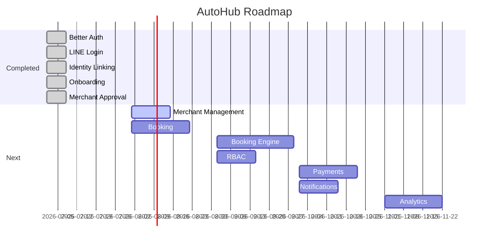

# Roadmap

This roadmap reflects the **current state** of AutoHub and planned next phases. Completed items are verified against the codebase. Future items are not started unless marked otherwise.

## Completed phases

### ✅ Better Auth

- Better Auth v1.6.x configured with Prisma adapter
- Auth models: `AuthUser`, `AuthSession`, `AuthAccount`, `AuthVerification`
- API route: `/api/auth/[...all]`
- Server and client session helpers
- `proxy.ts` route protection
- Login and logout UI

**Documentation:** [authentication.md](./authentication.md)

### ✅ LINE Login

- LINE OAuth via `genericOAuth` + `line()` plugin
- PKCE enabled
- Email/password disabled
- LINE user ID captured in `AuthAccount`

**Documentation:** [authentication.md](./authentication.md#line-login)

### ✅ Identity Linking

- `User.authUserId` links domain `User` to `AuthUser`
- `resolveIdentityLink()` determines linked/unlinked state
- `customSession` plugin enriches session with identity data
- Unlinked users redirected to `/onboarding`
- AuthUser remains independent from domain User

**Documentation:** [authentication.md](./authentication.md#identity-linking)

### ✅ Onboarding

- Customer onboarding: profile + tenant selection → domain `User`
- Merchant onboarding: profile + claim existing business OR request new business
- `MerchantClaim` and `MerchantOnboardingRequest` creation
- Zod validation, server actions
- Tenant selection from existing active tenants (never auto-created)
- No RBAC assignment during onboarding

**Documentation:** [onboarding.md](./onboarding.md)

### ✅ Merchant Approval

- Admin page: `/admin/merchant-requests`
- List pending `MerchantClaim` and `MerchantOnboardingRequest`
- Approve/reject server actions
- On approval: link `User.merchantId`, update `User.tenantId`, create `Merchant` (from request)
- Merchant dashboard (`/merchant/dashboard`) for approved merchants
- Waiting page (`/merchant/waiting`) for pending merchants
- Proxy routing for merchant access states

**Documentation:** [merchant.md](./merchant.md)

## Phase summary

> Timeline is indicative. Dates are planning estimates, not commitments.

## Next phases

### Merchant Management

**Status:** Not started

| Feature | Description |
|---------|-------------|
| Merchant CRUD UI | Create, edit, deactivate merchants |
| Branch management | Add/edit branches per merchant |
| Service catalog | Manage services per branch |
| Merchant settings | Business profile, contact info |
| Operator management | Invite/manage merchant users |

**Dependencies:** Merchant Approval (complete)

**Documentation:** [merchant.md](./merchant.md)

### Booking

**Status:** Schema only

| Feature | Description |
|---------|-------------|
| `Customer` record creation | Link customers to domain users or LINE |
| `Vehicle` management | Customer vehicle profiles |
| Booking creation UI | Customer-facing booking flow |
| Merchant booking view | View/manage bookings per branch |
| Booking status transitions | Implement `BookingStatus` workflow |

**Dependencies:** Merchant Management (branches, services), Customer model integration

**Documentation:** [booking.md](./booking.md)

### Booking Engine

**Status:** Not started

| Feature | Description |
|---------|-------------|
| Availability calculation | Time slot generation |
| Conflict detection | Prevent double-booking |
| Service duration scheduling | Multi-service appointments |
| Walk-in and manual booking | Non-online sources |
| Calendar integration | Branch operating hours |

**Dependencies:** Booking

**Documentation:** [booking.md](./booking.md#future-booking-engine)

### RBAC

**Status:** Schema only (`Role`, `UserRole`)

| Feature | Description |
|---------|-------------|
| `Permission` model | Resource + action permissions |
| Role assignment | Assign roles to domain users |
| Permission checking | `hasPermission()` helper |
| Route guards | Role-based route protection |
| Admin access control | Restrict `/admin/*` routes |
| Merchant operator roles | Scoped merchant permissions |

**Dependencies:** Identity Linking (complete)

**Documentation:** [rbac.md](./rbac.md)

### Payments

**Status:** Not started

| Feature | Description |
|---------|-------------|
| Payment provider integration | Stripe or regional provider |
| Booking payment | Pay on booking confirmation |
| Refund handling | Cancellation refunds |
| Merchant payout | Revenue distribution |

**Dependencies:** Booking, Booking Engine

### Notifications

**Status:** Not started

| Feature | Description |
|---------|-------------|
| Email notifications | Booking confirmation, reminders |
| LINE messaging | LINE push notifications |
| Merchant alerts | New booking, approval status |
| Admin alerts | Pending request notifications |

**Dependencies:** Booking, Merchant Approval

### Analytics

**Status:** Not started

| Feature | Description |
|---------|-------------|
| Merchant dashboard metrics | Bookings, revenue, utilization |
| Platform analytics | Tenant-level reporting |
| Booking funnel | Conversion tracking |
| Service popularity | Most booked services |

**Dependencies:** Booking, Booking Engine, Payments

## Technical debt and improvements

| Item | Priority | Notes |
|------|----------|-------|
| RBAC for admin routes | High | `/admin/merchant-requests` is unprotected |
| `Customer` creation during onboarding | Medium | Only `User` created today |
| Tenant CRUD / seeding tooling | Medium | Manual DB seeding required |
| Query-level tenant isolation | Medium | FK only, no middleware enforcement |
| Rejected merchant re-submission | Low | No flow after rejection |
| Remove unused `Geist` import | Low | Lint warning in `layout.tsx` |

## Schema-ready but not implemented

These models exist in Prisma but have no application logic:

- `Role`, `UserRole`
- `Branch`, `Service`
- `Customer`, `Vehicle`
- `Booking`, `BookingItem`

## How to contribute

1. Read [README.md](./README.md) for architecture overview
2. Check this roadmap for phase scope
3. Read the relevant domain document before implementing
4. Do not implement RBAC, booking, or tenant auto-creation unless explicitly in scope
5. Run quality gates: `prisma generate`, `lint`, `typecheck`, `build`

## Related documents

- [README.md](./README.md) — Architecture overview
- [database.md](./database.md) — Full data model
- [api.md](./api.md) — Current routes and actions
