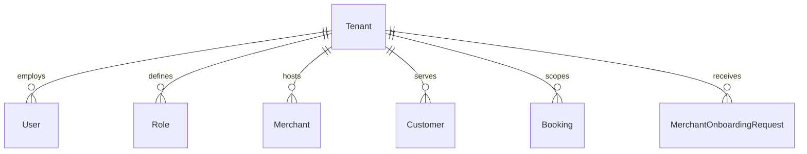
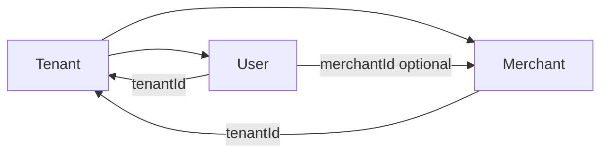
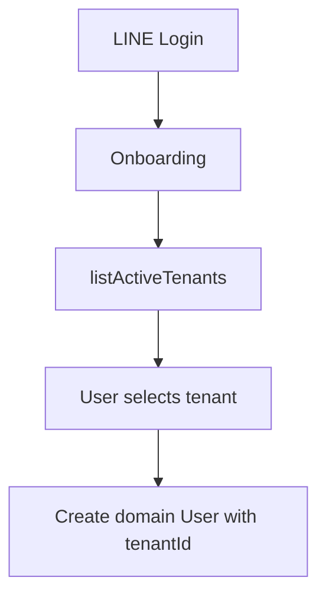
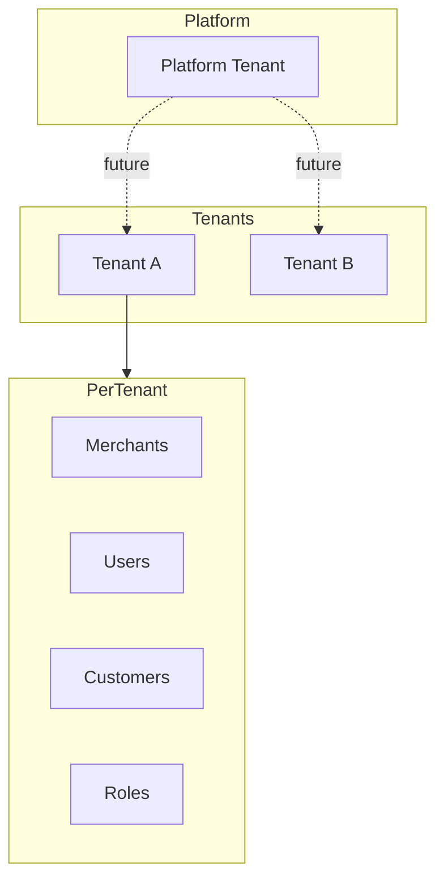

# Tenant

Tenants provide multi-tenant isolation in AutoHub. Each tenant represents an organizational boundary containing users, merchants, customers, bookings, and roles.

## Tenant model

| Field | Type | Notes |
|-------|------|-------|
| `id` | UUID | Primary key |
| `code` | String | Unique identifier (e.g. `autohub-th`) |
| `name` | String | Display name |
| `status` | `TenantStatus` | `ACTIVE` (default) or `INACTIVE` |

## Relationships



| Child model | FK field | Purpose |
|-------------|----------|---------|
| `User` | `tenantId` | Staff/operator domain user |
| `Role` | `tenantId` | Tenant-scoped roles (schema only) |
| `Merchant` | `tenantId` | Businesses in tenant |
| `Customer` | `tenantId` | Service customers |
| `Booking` | `tenantId` | Bookings scoped to tenant |
| `MerchantOnboardingRequest` | `tenantId` | New business requests |

## Merchant within tenant

Merchants belong to exactly one tenant.

```
Tenant (1) ──→ (N) Merchant
Merchant (1) ──→ (N) Branch
Branch (1) ──→ (N) Service
```

Merchant `code` is unique per tenant: `@@unique([tenantId, code])`

## User within tenant

Domain `User` records belong to exactly one tenant via `tenantId`.

Additional links after merchant approval:

| Field | Set when | Purpose |
|-------|----------|---------|
| `tenantId` | Onboarding; updated on merchant approval | Tenant membership |
| `merchantId` | On merchant claim/request approval | Merchant operator link |



### User vs Customer

Both `User` and `Customer` are tenant-scoped, but serve different purposes:

| Model | Purpose | Created during onboarding |
|-------|---------|------------------------|
| `User` | Domain identity linked to `AuthUser` | Yes (customer and merchant paths) |
| `Customer` | Service/booking customer profile | No (schema only) |

There is no FK between `User` and `Customer` in the current schema.

## Tenant resolution strategy (current)

Tenants are resolved by **explicit user selection** during onboarding. There is no automatic tenant detection or creation.



### Implementation

| Function | Location | Behavior |
|----------|----------|----------|
| `listActiveTenants()` | `lib/onboarding/queries.ts` | Returns tenants where `status = ACTIVE` |
| `assertTenantExists()` | `lib/onboarding/actions.ts` | Validates tenant is active before user creation |

### Rules

1. **Never auto-create tenants** — No application code creates `Tenant` records
2. **Only active tenants** — Inactive tenants are excluded from onboarding selection
3. **Tenant required for User** — `User.tenantId` is non-nullable
4. **Merchant approval may update tenant** — On claim approval, `User.tenantId` is set to the merchant's `tenantId`

### If no tenants exist

Onboarding forms display: *"No tenants are available yet. Contact an administrator."*

Tenants must be seeded or created manually in the database.

## Tenant and merchant approval

When a merchant claim or onboarding request is approved:

```
User.tenantId = Merchant.tenantId  (claim approval)
User.tenantId = Request.tenantId   (request approval)
User.merchantId = Merchant.id
```

This ensures the domain user is linked to both the correct tenant and merchant.

## Future organization model

The following is **planned**, not implemented:



### Planned capabilities

| Capability | Status |
|------------|--------|
| Tenant self-registration | Not implemented |
| Platform-level tenant admin | Not implemented |
| Tenant settings / branding | Not implemented |
| Tenant hierarchy (parent/child) | Not implemented |
| Tenant-scoped data isolation middleware | Not implemented |
| Subdomain-based tenant resolution | Not implemented |
| Automatic tenant provisioning | Not implemented |

### Anticipated tenant admin features (future)

- Create/update/deactivate tenants
- Assign tenant administrators via RBAC
- Per-tenant configuration (timezone, locale, business rules)
- Tenant onboarding for new organizations

## Data isolation

Currently, tenant isolation is **structural** (FK relationships) but not **enforced** at the query layer. Application code does not include a global tenant context or automatic query filtering.

Future implementation should add tenant-scoped queries to prevent cross-tenant data access.

## What is NOT implemented

- Tenant CRUD UI
- Automatic tenant creation
- Tenant-based subdomain routing
- Query-level tenant isolation middleware
- Tenant admin role assignment
- Tenant configuration management

## Related documents

- [onboarding.md](./onboarding.md) — Tenant selection during onboarding
- [merchant.md](./merchant.md) — Merchant-tenant relationship
- [rbac.md](./rbac.md) — Tenant-scoped roles (planned)
- [database.md](./database.md) — Full ERD
