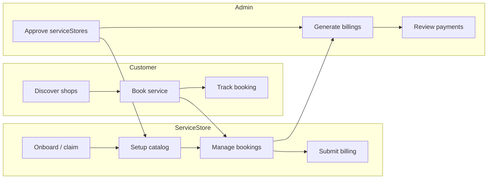
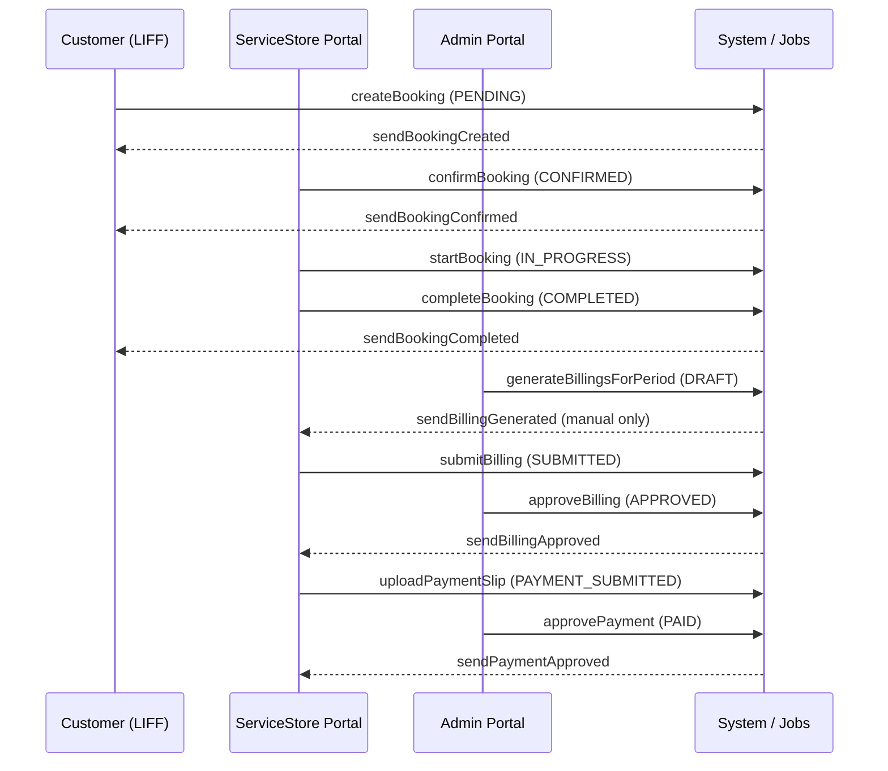
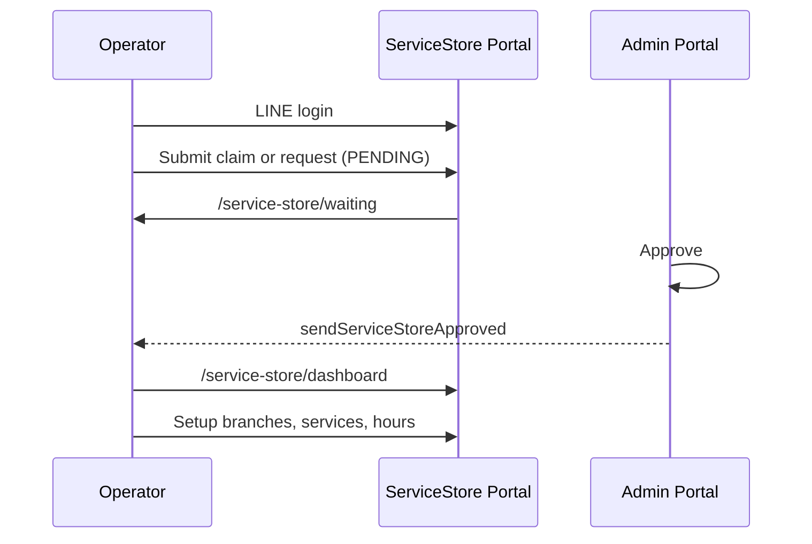

# AutoHub MVP — Product Workflow Specification

**Version:** MVP (as implemented in codebase)  
**Last updated:** July 2026  
**Scope:** Customer (LINE OA + LIFF), ServiceStore Portal, Admin Portal

This document describes the intended and implemented product workflows for AutoHub MVP. It is derived from the current codebase (`apps/web`) and Prisma schema. Use it as the single reference for product behavior, status transitions, and implementation gaps before LINE OA customer integration.

---

## Table of Contents

1. [System Overview](#1-system-overview)
2. [Shared Concepts](#2-shared-concepts)
3. [Customer Workflow (LINE OA + LIFF)](#3-customer-workflow-line-oa--liff)
4. [ServiceStore Portal Workflow](#4-serviceStore-portal-workflow)
5. [Admin Portal Workflow](#5-admin-portal-workflow)
6. [Cross-Portal Flows](#6-cross-portal-flows)
7. [Implementation Comparison](#7-implementation-comparison)

---

## 1. System Overview

AutoHub is a multi-tenant car-care booking platform with three independent web portals:

| Portal | Primary users | Auth | Home route |
|--------|---------------|------|------------|
| **Customer** | Car owners via LINE OA / LIFF | LINE OAuth (better-auth) | `/browse` |
| **ServiceStore** | Service shop operators | LINE OAuth (independent session) | `/service-store/dashboard` |
| **Admin** | Platform operators | LINE OAuth (independent session) | `/admin/dashboard` |

### Identity model

```
AuthUser (LINE OAuth session)
    └── User (domain profile, tenant-scoped)
            ├── Customer?  (auto-provisioned on customer surface)
            └── ServiceStore?  (linked after admin approval)
```

- A single LINE identity **may** hold both a Customer profile and a ServiceStore operator link on the same `User` row.
- Customer and serviceStore portals use **separate login entry points** and route guards.
- Route protection is enforced via `apps/web/proxy.ts` (Next.js proxy/middleware) plus page-level `require*` guards.

### High-level lifecycle



---

## 2. Shared Concepts

### 2.1 Core database entities

| Entity | Purpose |
|--------|---------|
| `Tenant` | Multi-tenant isolation (default: `AUTOHUB`) |
| `User` | Domain user linked to `AuthUser`; may reference `ServiceStore` |
| `Customer` | Customer profile; vehicles and bookings |
| `Vehicle` | Customer vehicle; unique plate per customer |
| `ServiceStore` | Service business; branches, billings |
| `ServiceStoreClaim` | Operator claim on existing serviceStore record |
| `ServiceStoreOnboardingRequest` | Request to create new serviceStore |
| `Branch` | Physical location; capacity, slot interval |
| `BranchOperatingHours` | Weekly open/close per branch |
| `Service` | Bookable service at a branch |
| `Booking` | Appointment with status timeline |
| `BookingItem` | Service line item with price snapshot |
| `Billing` | Monthly platform fee statement per serviceStore |
| `BillingItem` | One completed booking per billing line |
| `BillingPayment` | ServiceStore payment slip submission |
| `PlatformSettings` | Singleton platform config (fees, bank, VAT) |
| `JobExecution` | Background job run log |

### 2.2 Booking status machine

ServiceStore-driven transitions (state machine in `lib/booking/engine/state-machine.ts`):

```
PENDING ──confirm──► CONFIRMED ──start──► IN_PROGRESS ──complete──► COMPLETED
   │                      │
   └──cancel──► CANCELLED  ├──no-show──► NO_SHOW
                           └──cancel──► CANCELLED
```

| Status | Meaning | Who sets it |
|--------|---------|-------------|
| `PENDING` | Awaiting serviceStore confirmation | Customer online booking |
| `CONFIRMED` | Accepted; slot reserved | ServiceStore confirm, or walk-in create |
| `CHECKED_IN` | Customer arrived | **Not implemented** (enum only) |
| `IN_PROGRESS` | Service started | ServiceStore |
| `COMPLETED` | Service finished | ServiceStore |
| `CANCELLED` | Cancelled | ServiceStore, or pending-expiration job |
| `NO_SHOW` | Customer did not arrive | ServiceStore |

**Occupancy-blocking statuses** (slot capacity): `PENDING`, `CONFIRMED`, `CHECKED_IN`, `IN_PROGRESS`.

### 2.3 Billing status machine

```
DRAFT ──serviceStore submit──► SUBMITTED ──admin approve──► APPROVED
                                │                            │
                                └──admin reject──► REJECTED   │
                                                             │
                    serviceStore upload slip ◄───────────────────┘
                             │
                             ▼
                    PAYMENT_SUBMITTED ──admin approve──► PAID
                             │
                             └──admin reject──► PAYMENT_REJECTED
                                      │
                                      └──serviceStore re-upload──► PAYMENT_SUBMITTED
```

### 2.4 Notification matrix (LINE push)

| Event | Function | Recipient | Implemented |
|-------|----------|-----------|-------------|
| Booking created | `sendBookingCreated` | Customer | Yes |
| Booking confirmed | `sendBookingConfirmed` | Customer | Yes |
| Booking started | `sendBookingStarted` | Customer | Yes |
| Booking completed | `sendBookingCompleted` | Customer | Yes |
| Booking cancelled | `sendBookingCancelled` | Customer | Yes |
| Booking no-show | `sendBookingNoShow` | Customer | Yes |
| Booking reminder | `sendBookingReminder` | Customer | **No** (defined, never called) |
| ServiceStore approved | `sendServiceStoreApproved` | ServiceStore claimant | Yes |
| Billing generated | `sendBillingGenerated` | ServiceStore users | Manual generation only |
| Billing approved | `sendBillingApproved` | ServiceStore users | Yes |
| Payment approved | `sendPaymentApproved` | ServiceStore users | Yes |
| Claim/onboarding rejected | — | ServiceStore | **No** |
| Billing rejected | — | ServiceStore | **No** |
| Payment rejected | — | ServiceStore | **No** |
| New PENDING booking | — | ServiceStore | **No** |
| Pending booking auto-cancel | — | Customer | **No** |
| Billing due reminder | — | ServiceStore | **No** (DB events only) |

Notifications require `lineUserId` on the recipient; failures are logged and do not block the primary action.

---

## 3. Customer Workflow (LINE OA + LIFF)

### 3.1 Entry and authentication

#### Entry points

| Entry | URL | When used |
|-------|-----|-----------|
| Marketing site | `/` | Public landing |
| LINE gate | `/open-in-line?callbackUrl=` | Unauthenticated access to customer routes |
| Dev login fallback | `/login?callbackUrl=` | Development / non-LIFF browser |
| LIFF home (intended) | `/browse` | Primary customer app entry |
| Deep links (planned) | `/bookings`, `/bookings/new?...` | Rich Menu / OA message links |

#### User actions

1. User opens LINE OA Rich Menu or message link (intended) or visits web URL.
2. If unauthenticated on a customer route → redirected to `/open-in-line`.
3. User signs in with LINE OAuth (via OA/LIFF in production; `/login` in dev).
4. User lands on `callbackUrl` or `/browse`.

#### System actions

1. `proxy.ts` intercepts unauthenticated customer routes → `/open-in-line`.
2. On first authenticated customer-surface visit, `ensureCustomerProfile()` runs:
   - Resolves active tenant (`AUTOHUB` or first active).
   - Creates `User` + `Customer` from LINE session (`displayName`, `linePictureUrl`).
   - Stores `lineUserId` on both `User` and `Customer`.
3. `LiffCustomerLayout` wraps pages with bottom navigation.
4. `requireCustomerIdentity()` / `requireDomainUser()` guard server pages.

#### Status transitions

| State | Transition |
|-------|------------|
| No session | → LINE OAuth session |
| Session, no domain user | → `User` + `Customer` created |
| Session + customer | → Customer app access |

#### Database entities

`AuthUser`, `AuthAccount`, `AuthSession`, `Tenant`, `User`, `Customer`

#### Notifications

None at registration (welcome message not implemented).

#### Business rules

- **LINE-first:** Web login at `/login` is a dev fallback only.
- **No manual customer onboarding:** `/onboarding/customer` redirects to `/open-in-line`.
- **Auto-provision:** Profile created on first customer-surface access, not at OAuth time on serviceStore/admin surfaces.
- **Tenant default:** `AUTOHUB` active tenant, else first active tenant.
- **Uniqueness:** `lineUserId` and `email` must be unique on `User`/`Customer`.

#### Edge cases

| Case | Behavior |
|------|----------|
| Provision conflict (`LINE_USER_ALREADY_LINKED`) | Redirect `/login?error=auth` |
| Auth failure during provision | Redirect `/login?error=auth` |
| Same LINE user is also serviceStore | Allowed; customer provision independent |

#### Implementation status

| Aspect | Status |
|--------|--------|
| LINE OAuth session | **Completed** |
| Auto customer provision | **Completed** |
| `/open-in-line` gate page | **Completed** |
| LIFF SDK (`@line/liff`) | **Missing** |
| LIFF ID-token auth bridge | **Missing** |
| In-client detection | **Partially completed** (stub header check) |
| Inbound LINE webhook / chat | **Missing** |
| Rich Menu integration | **Missing** |

---

### 3.2 Browse and discover serviceStores

#### Entry point

`/browse` (home), `/browse?nearby=1`, `/browse?q={keyword}`

#### User actions

1. View hero, upcoming and recent booking cards.
2. Filter: All shops / Nearby.
3. Search by serviceStore name.
4. Tap serviceStore card → `/browse/[serviceStoreId]`.
5. Optionally view branch → `/browse/[serviceStoreId]/branches/[branchId]`.
6. Tap **Book Now** (bookable partner) or **View Details** / **Call** (non-bookable).

#### System actions

1. `listBrowseServiceStoresPaginated()` returns `ACTIVE` serviceStores.
2. `isServiceStoreBookable()` / `resolveMarketplaceBookingStatus()` determines CTA:
   - **BOOKABLE:** approved claim + `ACTIVE` + ≥1 branch with active services.
   - **DISCOVERED / CLAIM_PENDING / SETUP_INCOMPLETE:** view-only or call.
3. `getCustomerBookingsPaginated()` populates home booking cards.
4. Nearby sort uses distance from Bangkok center (not device GPS).

#### Status transitions

None (read-only discovery).

#### Database entities

`ServiceStore`, `ServiceStoreClaim`, `Branch`, `Service`, `Booking`, `Customer`

#### Notifications

None.

#### Business rules

- Only `ServiceStore.status === ACTIVE` shown in browse.
- `ServiceStore.bookingEnabled` is **not** checked (Phase 2 TODO).
- Non-partner serviceStores remain discoverable with call/details CTA.
- ServiceStore detail hours on browse pages are **hardcoded placeholders**, not from `BranchOperatingHours`.
- Rating and starting price on cards are **placeholder UI values**.

#### Edge cases

| Case | Behavior |
|------|----------|
| No upcoming bookings | Empty state on home |
| ServiceStore not bookable | Detail page shows unavailable message; no book CTA |
| Search with no results | Empty list |

#### Implementation status

| Aspect | Status |
|--------|--------|
| ServiceStore list / search | **Completed** |
| Bookability rules | **Completed** |
| Nearby filter | **Partially completed** (fixed reference point, no geolocation) |
| DB-driven hours on detail | **Missing** |
| Real ratings / pricing | **Missing** (placeholders) |
| Map preview | **Missing** (placeholder div) |

---

### 3.3 Online booking (browse → confirm → success)

#### Entry point

`/bookings/new?branchId={id}&serviceId={id}&vehicleId={id?}`

Typically reached from serviceStore/branch browse after **Book Now**.

#### User actions

1. Review shop and service summary.
2. Select vehicle (dropdown) or add new via `/vehicles/new?returnTo=...`.
3. Pick date (Today / Tomorrow / calendar).
4. Pick available time slot.
5. Submit **Confirm booking**.

#### System actions

1. **Gate:** `getServiceStoreBookingFactsByBranchId` + `isServiceStoreBookable`.
2. **Catalog:** `resolveBookingCatalog()` loads branch, service, serviceStore.
3. **Slots:** Client calls `GET /api/branches/[branchId]/available-slots?serviceId=&date=`.
4. **Submit:** Server action `createBooking()`:
   - Validates future datetime, bookability, active branch/service.
   - Validates slot still available (capacity + overlap).
   - Validates vehicle ownership.
   - Creates `Booking` (`source: AUTOHUB`, `status: PENDING`).
   - Assigns `bookingNumber` (`AH-YYMMDD-######`).
   - Creates `BookingItem` with `unitPrice` snapshot.
5. **Notify:** `sendBookingCreated()` LINE push to customer.
6. **Redirect:** `/bookings/[bookingNumber]` (success panel for `PENDING`/`CONFIRMED`).

#### Status transitions

```
(none) ──createBooking──► PENDING
```

#### Database entities

`Booking`, `BookingItem`, `BookingNumberCounter`, `Customer`, `Vehicle`, `Branch`, `Service`, `ServiceStore`, `Tenant`

#### Notifications

| Trigger | Notification |
|---------|--------------|
| Booking created | `sendBookingCreated` → customer |

#### Business rules

- Customer bookings always start as `PENDING` (serviceStore must confirm).
- Slot engine respects: operating hours, `slotIntervalMinutes`, service `duration + bufferMinutes`, `concurrentCapacity`, past slots excluded.
- Vehicle must belong to customer; duplicate plate per customer blocked.
- Default vehicle: URL `vehicleId` → last booking vehicle → first vehicle.
- Booking datetime must be in the future (customer path).

#### Edge cases

| Case | Behavior |
|------|----------|
| Non-bookable serviceStore at booking URL | Friendly unavailable card (not 404) |
| Invalid branch/service | `notFound()` |
| Slot taken between pick and submit | Error: "time slot no longer available" |
| No vehicles on file | Empty state → add vehicle flow |
| Missing LINE user for notification | Booking succeeds; notification skipped |
| `vehicleMode: "new"` in API | Backend supports; **UI hardcodes existing vehicle only** |

#### Implementation status

| Aspect | Status |
|--------|--------|
| Booking form UI | **Completed** |
| Slot API + validation engine | **Completed** |
| `createBooking` action | **Completed** |
| Success panel | **Completed** |
| Inline new-vehicle during booking | **Missing** (backend ready) |
| Customer cancel/reschedule | **Missing** |

---

### 3.4 My bookings

#### Entry point

`/bookings`, `/bookings/[bookingNumber]`

#### User actions

1. View paginated booking list.
2. Open booking detail.
3. Call shop / open maps (external links).
4. Read cancel guidance: contact shop directly (no in-app cancel).

#### System actions

1. `getCustomerBookingsPaginated()` / `getCustomerBooking()`.
2. Ownership enforced: `customerId` must match session customer.
3. `BookingTimeline` shows read-only status progress.
4. `BookingSuccessPanel` for `PENDING`/`CONFIRMED`; full detail for other statuses.

#### Status transitions

Read-only from customer perspective. ServiceStore/job drives transitions (see §4.5, §5.5).

#### Database entities

`Booking`, `BookingItem`, `Service`, `Branch`, `ServiceStore`, `Vehicle`

#### Notifications

Customer receives LINE pushes when serviceStore changes status (see §2.4).

#### Business rules

- Upcoming = `PENDING`, `CONFIRMED`, or `IN_PROGRESS` with `bookingDate >= now`.
- Customer cannot change booking status.

#### Edge cases

| Case | Behavior |
|------|----------|
| Wrong customer / unknown booking | `notFound()` |
| Terminal status booking | Full detail view, no success panel |

#### Implementation status

| Aspect | Status |
|--------|--------|
| List + detail | **Completed** |
| Timeline | **Completed** |
| Customer-initiated cancel | **Missing** |

---

### 3.5 Vehicle management

#### Entry point

`/vehicles`, `/vehicles/new?returnTo=`

#### User actions

1. View vehicle list.
2. Add vehicle (FAB or dedicated page).
3. During booking: **Add vehicle** → return to booking with `?vehicleId=`.
4. Edit/delete UI opens sheets (stubs).

#### System actions

1. `createCustomerVehicle()` validates and creates `Vehicle`.
2. Duplicate plate per customer blocked.
3. `safeReturnTo()` prevents open redirects on `returnTo`.
4. Redirect appends `vehicleId` to booking URL.

#### Status transitions

None.

#### Database entities

`Vehicle`, `Customer`

#### Notifications

None.

#### Business rules

- Plate + brand + model required; province/year/color optional.
- `@@unique([customerId, licensePlate])`.

#### Edge cases

| Case | Behavior |
|------|----------|
| Duplicate plate | Field validation error |
| Invalid `returnTo` | Falls back to safe path |

#### Implementation status

| Aspect | Status |
|--------|--------|
| Create vehicle | **Completed** |
| Return-to-booking flow | **Completed** |
| Edit vehicle | **Missing** |
| Delete vehicle | **Missing** (UI stub) |

---

### 3.6 Customer profile

#### Entry point

`/profile` (`/more` redirects here)

#### User actions

1. View display name, avatar (from LINE), phone, email.
2. Log out.

#### System actions

1. `requireDomainUser()` loads customer context.
2. Display name priority: LINE display name → session name → customer name.

#### Database entities

`Customer`, `User`, `AuthUser`

#### Notifications

None.

#### Business rules

- Profile is read-only in MVP.
- Phone/email remain null unless populated elsewhere.

#### Implementation status

| Aspect | Status |
|--------|--------|
| Read-only profile | **Completed** |
| Profile edit | **Missing** |
| Phone capture onboarding | **Missing** (deprecated flow) |

---

## 4. ServiceStore Portal Workflow

### 4.1 Landing and LINE login

#### Entry point

`/service-store`, `/service-store/login?callbackUrl=`

#### User actions

1. View marketing landing with capability cards.
2. Choose: **Login with LINE**, **Claim Business**, or **Create Business**.
3. Complete LINE OAuth on login page.

#### System actions

1. `PortalLoginScreen` initiates `authClient.signIn.oauth2({ providerId: "line" })`.
2. `proxy.ts` routes authenticated user by serviceStore access state:
   - Approved → `/service-store/dashboard`
   - Pending → `/service-store/waiting`
   - None → `/service-store/onboarding` (or `callbackUrl`)

#### Status transitions

Session established; serviceStore access state evaluated.

#### Database entities

`AuthUser`, `AuthAccount`, `AuthSession`

#### Notifications

None.

#### Business rules

- ServiceStore portal does **not** auto-provision `Customer`.
- ServiceStore and customer sessions are independent entry points.

#### Implementation status

| Aspect | Status |
|--------|--------|
| Landing page | **Completed** |
| LINE login UI | **Completed** |
| Access-state routing | **Completed** |

---

### 4.2 Claim business

#### Entry point

`/service-store/onboarding?mode=claim` (after LINE login)

#### User actions

1. Select tenant.
2. Enter operator profile (name, phone, email).
3. Search serviceStores by name/code.
4. Select target serviceStore.
5. Submit claim.

#### System actions

1. `completeServiceStoreOnboarding()` (claim mode):
   - Create or update `User` for tenant.
   - Validate serviceStore exists in tenant.
   - Block duplicate pending claim (same user + serviceStore).
   - Create `ServiceStoreClaim` (`status: PENDING`).
2. Redirect → `/service-store/waiting`.

#### Status transitions

```
ServiceStoreClaim: (none) ──submit──► PENDING
ServiceStore: unchanged until admin approval
User.serviceStoreId: null
```

#### Database entities

`User`, `ServiceStore`, `ServiceStoreClaim`, `Tenant`

#### Notifications

None at submit. `sendServiceStoreApproved` on admin approval.

#### Business rules

- Business code format for new requests: `^[a-z0-9-]+$` (claim uses existing serviceStore code).
- Claim search does not filter by serviceStore status (DRAFT/ACTIVE all searchable).
- Multiple users may claim the same serviceStore (only one pending per user).

#### Edge cases

| Case | Behavior |
|------|----------|
| Duplicate pending claim | Validation error |
| ServiceStore not found | Validation error |
| Admin rejects | Claim → `REJECTED`; user returns to onboarding |

#### Implementation status

| Aspect | Status |
|--------|--------|
| Claim form + search | **Completed** |
| Pending claim creation | **Completed** |
| Rejection UX on waiting page | **Missing** |
| Exclusivity on claimed serviceStore | **Missing** |

---

### 4.3 Create business

#### Entry point

`/service-store/onboarding?mode=request`

#### User actions

1. Select tenant.
2. Enter operator profile.
3. Enter business name, code, contact fields.
4. Submit request.

#### System actions

1. `completeServiceStoreOnboarding()` (request mode):
   - Create/update `User`.
   - Block if `businessCode` exists as `ServiceStore.code` in tenant.
   - Create `ServiceStoreOnboardingRequest` (`status: PENDING`).
2. Redirect → `/service-store/waiting`.

#### Status transitions

```
ServiceStoreOnboardingRequest: (none) ──submit──► PENDING
```

#### Database entities

`User`, `ServiceStoreOnboardingRequest`, `Tenant`

#### Notifications

`sendServiceStoreApproved` on admin approval only.

#### Business rules

- Unique business code per tenant at submit and again at admin approve.

#### Implementation status

| Aspect | Status |
|--------|--------|
| Request form | **Completed** |
| Waiting page | **Completed** |
| Rejection notification | **Missing** |

---

### 4.4 Waiting for approval

#### Entry point

`/service-store/waiting`

#### User actions

1. View pending claim or onboarding request details.
2. Wait for admin review.

#### System actions

1. `getServiceStoreAccessState()` must be `pending`.
2. Loads pending `ServiceStoreClaim` or `ServiceStoreOnboardingRequest`.
3. Approved users redirected to dashboard; unlinked users redirected to onboarding.

#### Status transitions

```
pending ──admin approve──► approved (User.serviceStoreId set)
pending ──admin reject──► none (user must re-onboard)
```

#### Database entities

`ServiceStoreClaim`, `ServiceStoreOnboardingRequest`, `User`, `ServiceStore`

#### Notifications

Approval: `sendServiceStoreApproved`. Rejection: none.

#### Implementation status

| Aspect | Status |
|--------|--------|
| Waiting UI | **Completed** |
| Rejected-state messaging | **Missing** |

---

### 4.5 ServiceStore dashboard

#### Entry point

`/service-store/dashboard`

#### User actions

1. View KPIs: today's bookings/revenue, status counts, outstanding billing.
2. Navigate to recent/upcoming bookings, customers.
3. Create walk-in booking (header CTA).

#### System actions

1. `requireServiceStoreSession()` + access checks.
2. `getServiceStoreDashboardMetrics()` aggregates serviceStore-scoped data.

#### Database entities

`Booking`, `Billing`, `Customer`, `Service`, `ServiceStore`, `User`

#### Implementation status

| Aspect | Status |
|--------|--------|
| Dashboard metrics | **Completed** |
| Navigation shell | **Completed** |

---

### 4.6 Branch management

#### Entry points

`/service-store/branches`, `/service-store/branches/new`, `/service-store/branches/[branchId]`

#### User actions

1. List/search branches.
2. Create branch (code, name, phone, address, slot interval, capacity).
3. Edit branch details.
4. Delete branch.
5. Navigate to operating hours and services.

#### System actions

| Action | Server action | Side effects |
|--------|---------------|--------------|
| Create | `createBranch` | Seeds default hours (09:00–18:00, 7 days) |
| Update | `updateBranch` | Code uniqueness per serviceStore |
| Delete | `deleteBranch` | Ownership check only |

#### Status transitions

None (branch has no status enum).

#### Database entities

`Branch`, `BranchOperatingHours`, `ServiceStore`

#### Business rules

- `@@unique([serviceStoreId, code])` on branches.
- Delete does not check for existing bookings (DB may restrict).

#### Implementation status

| Aspect | Status |
|--------|--------|
| CRUD | **Completed** |
| Safe delete with bookings | **Missing** |

---

### 4.7 Service management

#### Entry points

`/service-store/branches/[branchId]/services`, `.../services/new`, `.../services/[serviceId]`

#### User actions

1. List/search services (active/inactive filter).
2. Create service (code, name, duration, buffer, price).
3. Edit service; toggle `isActive`.
4. Delete service.

#### System actions

`createService`, `updateService`, `deleteService` in `catalog-actions.ts`.

#### Database entities

`Service`, `Branch`

#### Business rules

- `@@unique([branchId, code])`.
- Walk-in and online booking require active services.

#### Implementation status

| Aspect | Status |
|--------|--------|
| CRUD | **Completed** |

---

### 4.8 Operating hours

#### Entry point

`/service-store/branches/[branchId]/hours`

#### User actions

1. Set open/close time per day of week.
2. Mark days closed.
3. Save hours.

#### System actions

`updateBranchOperatingHours()` — 7 rows per branch; open < close unless `isClosed`.

#### Database entities

`BranchOperatingHours`, `Branch`

#### Business rules

- Slot generation uses branch hours; defaults apply if hours missing.

#### Implementation status

| Aspect | Status |
|--------|--------|
| Hours form | **Completed** |

---

### 4.9 Booking management (online + walk-in)

#### Entry points

`/service-store/bookings`, `/service-store/bookings/[bookingNumber]`, `/service-store/bookings/new`

#### User actions — list/detail

1. Filter bookings by status, branch, date, keyword.
2. Open booking detail.
3. Perform status actions: Confirm, Start, Complete, Cancel, No-show.
4. Navigate to customer CRM from detail.

#### User actions — walk-in

1. Select branch and service.
2. Set date/time (defaults to now).
3. Choose customer type: existing (by phone) or temporary walk-in.
4. Choose vehicle: new or existing plate.
5. Submit.

#### System actions — online bookings

Created by customer `createBooking()` — serviceStore receives `PENDING` booking.

#### System actions — walk-in

`createWalkInBooking()`:
- `source: WALK_IN`, `status: CONFIRMED`, `confirmedAt` set.
- `allowWalkIn: true` bypasses marketplace bookability and future-date checks.
- Customer lookup by phone (`isWalkIn: false`) or creates temporary customer (`isWalkIn: true`).
- `sendBookingConfirmed` to customer if `lineUserId` present.

#### System actions — status changes

| Action | Function | New status |
|--------|----------|------------|
| Confirm | `confirmBooking` | `CONFIRMED` |
| Start | `startBooking` | `IN_PROGRESS` |
| Complete | `completeBooking` | `COMPLETED` |
| Cancel | `cancelBookingAsServiceStore` | `CANCELLED` |
| No-show | `markBookingNoShow` | `NO_SHOW` |

Each transition validates state machine and sends corresponding LINE notification to customer.

#### Status transitions

See §2.2. Walk-in enters at `CONFIRMED`.

#### Database entities

`Booking`, `BookingItem`, `Customer`, `Vehicle`, `Branch`, `Service`

#### Notifications

To customer on each status change. No notification to serviceStore on new `PENDING` booking.

#### Business rules

- ServiceStore may only act on bookings at own branches.
- `COMPLETED` bookings with `completedAt` in period become billable.

#### Edge cases

| Case | Behavior |
|------|----------|
| Walk-in, customer without LINE | Booking succeeds; no push |
| Walk-in, no active services | Empty state on walk-in page |
| `CHECKED_IN` | No UI or transition |

#### Implementation status

| Aspect | Status |
|--------|--------|
| List + filters | **Completed** |
| Detail + actions | **Completed** |
| Walk-in create | **Completed** |
| `CHECKED_IN` workflow | **Missing** |
| ServiceStore alert on new booking | **Missing** |

---

### 4.10 Customer CRM

#### Entry points

`/service-store/customers`, `/service-store/customers/[customerId]`, `.../vehicles/[vehicleId]`

#### User actions

1. Search customers by name, phone, plate.
2. View customer profile: contact, visit metrics, favorite services, vehicles, booking history.
3. View vehicle detail: spending, services received, booking history.
4. Navigate to booking detail from history.

#### System actions

1. `searchServiceStoreCustomersPaginated()` — customers with ≥1 booking at serviceStore's branches.
2. `getServiceStoreCustomerDetail()` / `getServiceStoreVehicleDetail()` — aggregated metrics from `COMPLETED` bookings.

#### Database entities

`Customer`, `Vehicle`, `Booking`, `BookingItem`, `Service`

#### Business rules

- **Read-only** CRM in MVP.
- Scope limited to customers with booking relationship.

#### Implementation status

| Aspect | Status |
|--------|--------|
| Search + detail | **Completed** |
| Edit notes / customer data | **Missing** |

---

### 4.11 Billing

#### Entry points

`/service-store/billings`, `/service-store/billings/[billingId]`

#### User actions

1. List billings; filter by status.
2. View billing detail (summary, line items, payment history).
3. Submit billing (`DRAFT` → `SUBMITTED`).
4. Upload payment slip when `APPROVED` or `PAYMENT_REJECTED`.

#### System actions

| Action | Condition | Result |
|--------|-----------|--------|
| Submit | `status === DRAFT` | `SUBMITTED`, `submittedAt` |
| Upload slip | `APPROVED` or `PAYMENT_REJECTED` | Creates `BillingPayment` (`PENDING`); billing → `PAYMENT_SUBMITTED` |

Billing generation is **admin-only** (see §5.4).

#### Status transitions

See §2.3.

#### Database entities

`Billing`, `BillingItem`, `BillingPayment`, `Booking`, `PlatformSettings`

#### Notifications

| Event | When |
|-------|------|
| `sendBillingGenerated` | Admin manual generation only |
| `sendBillingApproved` | Admin approves statement |
| `sendPaymentApproved` | Admin approves payment |

#### Business rules

- Fee = `PlatformSettings.bookingFee` × completed booking count (not service price).
- VAT applied to subtotal at generation time (snapshot on `Billing`).
- `REJECTED` billing has no serviceStore resubmit path.

#### Implementation status

| Aspect | Status |
|--------|--------|
| List + detail | **Completed** |
| Submit + slip upload | **Completed** |
| Resubmit rejected billing | **Missing** |

---

### 4.12 ServiceStore settings

#### Entry point

`/service-store/profile` (nav label: Settings)

#### User actions

1. Update business name, description, phone, email, website.

#### System actions

`updateServiceStoreProfile()` with `serviceStoreProfileSchema`.

#### Database entities

`ServiceStore`

#### Implementation status

| Aspect | Status |
|--------|--------|
| Profile settings | **Completed** |
| Staff management | **Missing** |
| Notification preferences | **Missing** |

---

## 5. Admin Portal Workflow

### 5.1 Landing and LINE login

#### Entry point

`/admin`, `/admin/login`

#### User actions

1. View admin marketing landing.
2. Sign in with LINE.

#### System actions

1. `requireAdminSession()` on protected pages (session only).
2. Authenticated login → redirect `/admin/dashboard`.
3. `proxy.ts` redirects unauthenticated `/admin/*` to login.

#### Business rules

- **No role check:** any authenticated LINE session can access admin routes.
- `Role` / `UserRole` exist in schema but are unused.

#### Implementation status

| Aspect | Status |
|--------|--------|
| Login + routing | **Completed** |
| Admin RBAC | **Missing** |

---

### 5.2 Platform dashboard

#### Entry point

`/admin/dashboard`

#### User actions

View platform KPIs and charts (read-only).

#### System actions

`lib/reporting/queries.ts` — serviceStore/customer/booking counts, revenue, pending queues, trends.

#### Database entities

`ServiceStore`, `Customer`, `Booking`, `Billing`, `ServiceStoreClaim`, `ServiceStoreOnboardingRequest`, `BillingPayment`

#### Implementation status

| Aspect | Status |
|--------|--------|
| Dashboard | **Completed** |

---

### 5.3 ServiceStore request approval

#### Entry point

`/admin/service-store-requests`

#### User actions

1. Review pending claims and onboarding requests.
2. Approve or reject each item.

#### System actions — approve claim

`approveServiceStoreClaim()`:
- `ServiceStoreClaim` → `APPROVED`
- `User.serviceStoreId` + `tenantId` set
- `ServiceStore.status` → `ACTIVE`, `bookingEnabled` → `true`
- `sendServiceStoreApproved`

#### System actions — approve onboarding

`approveServiceStoreOnboardingRequest()`:
- Create `ServiceStore` (`ACTIVE`, `bookingEnabled: true`)
- `ServiceStoreOnboardingRequest` → `APPROVED`
- Link `User` to serviceStore
- `sendServiceStoreApproved`

#### System actions — reject

- Claim/request → `REJECTED`, `reviewedAt` set
- No notification

#### Status transitions

```
ServiceStoreClaim: PENDING → APPROVED | REJECTED
ServiceStoreOnboardingRequest: PENDING → APPROVED | REJECTED
ServiceStore: (created or updated) → ACTIVE on approval
```

#### Database entities

`ServiceStoreClaim`, `ServiceStoreOnboardingRequest`, `ServiceStore`, `User`

#### Authorization gap

`assertRequestManager()` checks session + linked `User`, **not** admin role. Callable by any authenticated domain user.

#### Implementation status

| Aspect | Status |
|--------|--------|
| Review UI | **Completed** |
| Approve/reject actions | **Completed** |
| Admin-only authorization | **Missing** |
| Rejection notifications | **Missing** |
| Audit trail | **Missing** |

---

### 5.4 Billing generation and review

#### Entry points

`/admin/billings`, `/admin/billings/[billingId]`

#### User actions

1. Set billing period; trigger **Generate billings**.
2. List billings; filter by status.
3. Approve or reject submitted statements.
4. Approve or reject payment slips.

#### System actions — generation

`generateBillingsForPeriod()`:
1. Load `PlatformSettings` snapshot.
2. Find `Booking` where `status = COMPLETED` and `completedAt` in `[periodStart, periodEnd]`.
3. Group by serviceStore; skip duplicate `(serviceStoreId, periodStart, periodEnd)`.
4. Create `Billing` (`DRAFT`) + `BillingItem` per booking.
5. Manual trigger: `sendBillingGenerated` to serviceStore users with `lineUserId`.

**Scheduled job:** `monthly-billing-generation` (1st of month 00:05 Asia/Bangkok) — same logic, **no notifications**.

#### System actions — statement review

| Action | From | To |
|--------|------|-----|
| Approve | `SUBMITTED` | `APPROVED` + `invoiceNumber` |
| Reject | `SUBMITTED` | `REJECTED` + `rejectReason` |

Approve triggers `sendBillingApproved`.

#### System actions — payment review

| Action | From | To |
|--------|------|-----|
| Approve payment | `PAYMENT_SUBMITTED` | `PAID` + `receiptNumber` |
| Reject payment | `PAYMENT_SUBMITTED` | `PAYMENT_REJECTED` |

Approve triggers `sendPaymentApproved`.

#### Database entities

`Billing`, `BillingItem`, `BillingPayment`, `Booking`, `PlatformSettings`, `InvoiceNumberCounter`, `ReceiptNumberCounter`

#### Business rules

- One billing per serviceStore per period (unique constraint).
- One `BillingItem` per booking (`bookingId` unique on `BillingItem`).
- Fee per completed booking; discount always 0 in MVP.
- Outstanding billing metric = all `status != PAID`.

#### Edge cases

| Case | Behavior |
|------|----------|
| Overlapping periods | Same booking may cause unique constraint error on second bill |
| `REJECTED` billing | ServiceStore dead-end; no resubmit |
| ServiceStore without LINE | Notifications skipped |

#### Implementation status

| Aspect | Status |
|--------|--------|
| Manual generation | **Completed** |
| Scheduled generation | **Completed** |
| Statement/payment review | **Completed** |
| Rejection notifications | **Missing** |
| Pre-filter already-billed bookings | **Partially completed** (relies on DB constraint) |

---

### 5.5 Background jobs

#### Entry point

`/admin/jobs`, `/admin/jobs/[jobName]`

| Job | Schedule | Effect |
|-----|----------|--------|
| `monthly-billing-generation` | Monthly 00:05 | Previous month DRAFT billings |
| `pending-booking-expiration` | Every 5 min | `PENDING` + past `bookingDate` → `CANCELLED` |
| `billing-due-reminder` | Daily 00:00 | `BillingReminderEvent` for overdue billings |
| `storage-cleanup` | Daily 00:00 | Delete orphaned upload files |

#### Pending booking expiration

- Batch up to 2000 bookings per run.
- Sets `cancelledAt`; **no customer notification**.

#### Billing due reminder

- Threshold: `approvedAt + billingDueDays` from `PlatformSettings`.
- Statuses: `APPROVED`, `PAYMENT_REJECTED`.
- Writes `BillingReminderEvent` only — **no LINE push**.

#### Implementation status

| Aspect | Status |
|--------|--------|
| Job registry + manual run | **Completed** |
| Pending expiration | **Completed** |
| Expiration notification | **Missing** |
| Billing reminder notification | **Missing** |
| Booking reminder job | **Missing** |

---

### 5.6 Reports

#### Entry points

`/admin/reports`, `/admin/reports/export`

#### User actions

1. Filter by date, serviceStore, branch, status.
2. Preview report tables (50 rows).
3. Export CSV/Excel.

#### Report types

`booking`, `billing`, `settlement`, `customer`, `vehicle` (up to 1000 rows).

#### Authorization gap

Export uses `requireServerSession()` + linked `User` — not admin-specific.

#### Implementation status

| Aspect | Status |
|--------|--------|
| Report preview | **Completed** |
| CSV export | **Completed** |
| Admin-only export guard | **Missing** |
| True Excel format | **Missing** (CSV with `.xls` MIME) |

---

### 5.7 Platform settings

#### Entry point

`/admin/settings`

#### User actions

Edit and save platform configuration.

#### Fields

| Group | Fields |
|-------|--------|
| Billing | `bookingFee`, `vatRate`, `currency`, `billingDueDays` |
| Company | `companyName`, `taxId`, `address` |
| Bank | `bankName`, `accountName`, `accountNumber`, `bankBranch` |
| Storage | `storageProvider`, `bucketName`, `storageRegion` |
| Locale | `timeZone`, `dateFormat`, `timeFormat` |

#### Business rules

- Singleton `PlatformSettings` id `"default"`.
- New billings snapshot fee/VAT at generation; changes do not retroactively alter existing billings.

#### Implementation status

| Aspect | Status |
|--------|--------|
| Settings CRUD | **Completed** |

---

## 6. Cross-Portal Flows

### 6.1 End-to-end: customer books, serviceStore fulfills, platform bills



### 6.2 End-to-end: serviceStore onboarding



### 6.3 Coexistence: same LINE user as customer and serviceStore

- Customer profile auto-created on customer routes.
- ServiceStore link set on admin approval.
- Both profiles coexist on one `User` where applicable.

---

## 7. Implementation Comparison

Legend: **Completed** = usable in MVP · **Partially completed** = core works, known gaps · **Missing** = not implemented or stub only

### 7.1 Customer (LINE OA + LIFF)

| Workflow | Status | Notes |
|----------|--------|-------|
| Marketing → LINE gate | **Completed** | `/open-in-line` + proxy routing |
| LINE OAuth session | **Completed** | better-auth + LINE provider |
| LIFF SDK integration | **Missing** | Stub provider only |
| LIFF ID-token bridge | **Missing** | `LIFF_AUTH_BRIDGE_NOT_IMPLEMENTED` |
| Auto customer provision | **Completed** | `ensureCustomerProfile` |
| Browse / search serviceStores | **Completed** | |
| Bookability rules | **Completed** | `bookingEnabled` not checked |
| Online booking flow | **Completed** | |
| Slot availability API | **Completed** | |
| Booking list / detail | **Completed** | |
| Booking success panel | **Completed** | |
| Vehicle create | **Completed** | |
| Vehicle edit / delete | **Missing** | UI stubs |
| Profile view | **Completed** | Read-only |
| Profile edit | **Missing** | |
| Customer cancel booking | **Missing** | Contact shop message only |
| LINE outbound notifications | **Partially completed** | Lifecycle yes; reminder no |
| LINE inbound webhook | **Missing** | Registry stub only |
| Rich Menu / OA chat | **Missing** | |
| Nearby geolocation | **Missing** | Fixed Bangkok center |
| DB-driven serviceStore hours (browse) | **Missing** | Placeholder UI |

### 7.2 ServiceStore Portal

| Workflow | Status | Notes |
|----------|--------|-------|
| Landing + LINE login | **Completed** | |
| Claim business | **Completed** | |
| Create business | **Completed** | |
| Waiting approval | **Completed** | No rejected-state UX |
| Dashboard | **Completed** | |
| Branch CRUD | **Completed** | Unsafe delete |
| Service CRUD | **Completed** | |
| Operating hours | **Completed** | |
| Booking list / detail | **Completed** | |
| Booking status actions | **Completed** | No `CHECKED_IN` |
| Walk-in booking | **Completed** | |
| Customer CRM | **Partially completed** | Read-only |
| Billing view / submit | **Completed** | |
| Payment slip upload | **Completed** | |
| ServiceStore settings | **Completed** | Profile only |
| New booking alert | **Missing** | |
| Staff / multi-user | **Missing** | One user per serviceStore |
| Rejected billing resubmit | **Missing** | |

### 7.3 Admin Portal

| Workflow | Status | Notes |
|----------|--------|-------|
| Landing + LINE login | **Completed** | |
| Platform dashboard | **Completed** | |
| ServiceStore claim approval | **Completed** | Weak auth on actions |
| Onboarding approval | **Completed** | Weak auth on actions |
| Billing generation (manual) | **Completed** | |
| Billing generation (scheduled) | **Completed** | No serviceStore notify |
| Billing statement review | **Completed** | |
| Payment slip review | **Completed** | |
| Reports preview | **Completed** | |
| Report export | **Partially completed** | Weak auth; pseudo-Excel |
| Platform settings | **Completed** | |
| Job management | **Completed** | |
| Admin RBAC | **Missing** | |
| Rejection notifications | **Missing** | |
| Admin audit trail | **Missing** | |
| ServiceStore suspend enforcement | **Missing** | `SUSPENDED` unused |

### 7.4 Platform / infrastructure

| Capability | Status | Notes |
|------------|--------|-------|
| Three-portal routing (`proxy.ts`) | **Completed** | Active as Next.js proxy |
| Role-based access control | **Missing** | Schema only |
| `CHECKED_IN` booking status | **Missing** | Enum unused |
| `PENDING_VERIFICATION` serviceStore | **Missing** | Enum unused |
| `sendBookingReminder` | **Missing** | Function exists |
| Billing due LINE reminders | **Missing** | DB events only |
| `lib/admin/` module | **Missing** | Logic spread across libs |

---

## Appendix A — Route Reference

### Customer

| Route | Purpose |
|-------|---------|
| `/` | Marketing |
| `/open-in-line` | Unauthenticated gate |
| `/login` | Dev LINE login |
| `/browse` | Customer home |
| `/browse/[serviceStoreId]` | ServiceStore detail |
| `/browse/[serviceStoreId]/branches/[branchId]` | Branch services |
| `/bookings` | My bookings |
| `/bookings/new` | Confirm booking |
| `/bookings/[bookingNumber]` | Booking detail |
| `/vehicles` | My vehicles |
| `/vehicles/new` | Add vehicle |
| `/profile` | Profile |

### ServiceStore

| Route | Purpose |
|-------|---------|
| `/service-store` | Landing |
| `/service-store/login` | LINE login |
| `/service-store/onboarding` | Claim / create |
| `/service-store/waiting` | Pending approval |
| `/service-store/dashboard` | Dashboard |
| `/service-store/branches` | Branches |
| `/service-store/branches/new` | New branch |
| `/service-store/branches/[id]` | Edit branch |
| `/service-store/branches/[id]/hours` | Hours |
| `/service-store/branches/[id]/services` | Services |
| `/service-store/bookings` | Bookings |
| `/service-store/bookings/new` | Walk-in |
| `/service-store/bookings/[number]` | Detail |
| `/service-store/customers` | CRM |
| `/service-store/billings` | Billing |
| `/service-store/profile` | Settings |

### Admin

| Route | Purpose |
|-------|---------|
| `/admin` | Landing |
| `/admin/login` | LINE login |
| `/admin/dashboard` | Dashboard |
| `/admin/service-store-requests` | Approvals |
| `/admin/billings` | Billings |
| `/admin/reports` | Reports |
| `/admin/settings` | Settings |
| `/admin/jobs` | Background jobs |

---

## Appendix B — Key source files

| Area | Path |
|------|------|
| Schema | `apps/web/prisma/schema.prisma` |
| Route proxy | `apps/web/proxy.ts` |
| Portal constants | `apps/web/lib/auth/portals.ts` |
| Customer provision | `apps/web/lib/customer/ensure-customer-profile.ts` |
| Booking actions | `apps/web/lib/booking/actions.ts` |
| Booking state machine | `apps/web/lib/booking/engine/state-machine.ts` |
| Marketplace bookability | `apps/web/lib/marketplace/booking-availability.ts` |
| ServiceStore access | `apps/web/lib/service-store/access.ts` |
| Onboarding | `apps/web/lib/onboarding/actions.ts` |
| ServiceStore approvals | `apps/web/lib/service-store/actions.ts` |
| Catalog CRUD | `apps/web/lib/service-store/catalog-actions.ts` |
| Billing service | `apps/web/lib/billing/service.ts` |
| Billing actions | `apps/web/lib/billing/actions.ts` |
| LINE notifications | `apps/web/lib/line/line-notification-service.ts` |
| LIFF stubs | `apps/web/lib/liff/*` |
| Messaging stubs | `apps/web/lib/messaging/*` |
| Jobs | `apps/web/lib/jobs/definitions.ts` |
| Reporting | `apps/web/lib/reporting/queries.ts` |

---

*This document reflects the codebase as of MVP delivery. Update it when LINE OA integration, RBAC, or customer self-service features are implemented.*
